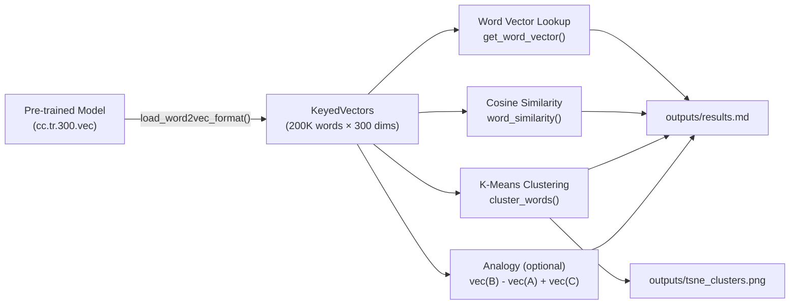
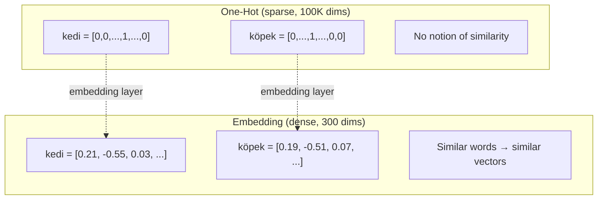
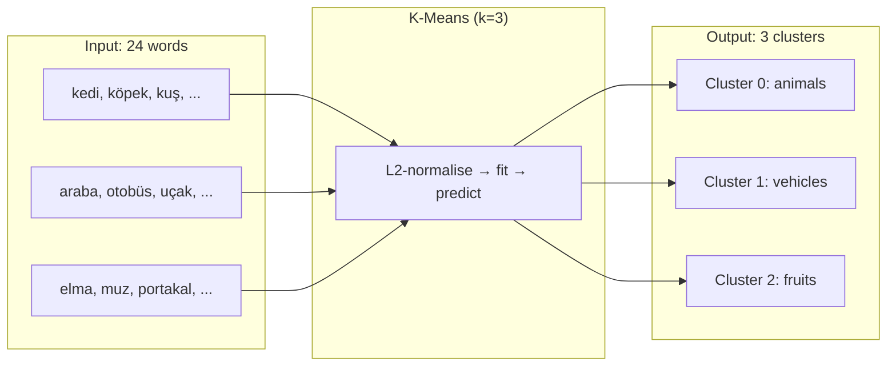
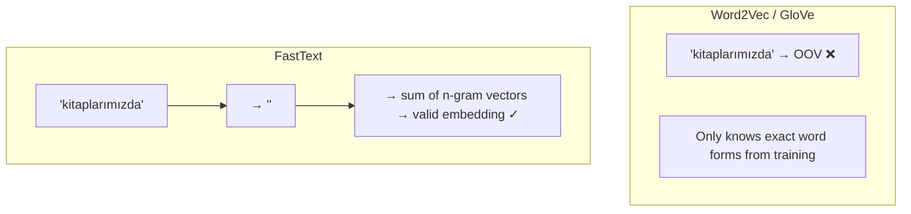
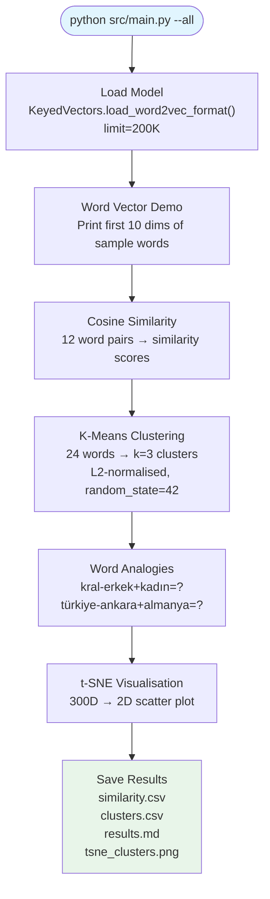

# Week 3: Turkish Word Embeddings — FastText, Similarity & Clustering

This project loads pre-trained Turkish word embedding vectors (FastText / GloVe), demonstrates cosine similarity between words, groups related words using K-Means clustering, and optionally runs word analogy tasks and t-SNE visualisation. It goes beyond the homework by adding analogy reasoning, dimensionality-reduction plots, and an auto-generated Markdown report.

---

## How It Works



---

## Core Concepts

### Word Embeddings

Instead of representing words as sparse one-hot vectors (one dimension per word in the vocabulary), word embeddings map each word to a **dense, low-dimensional vector** (typically 300 dimensions) where semantic similarity is captured by vector proximity.



### Cosine Similarity

Cosine similarity measures the angle between two vectors, ignoring their magnitude. This is ideal for embeddings because word frequency affects vector norms, and we care about **meaning**, not frequency.

```
cos(u, v) = (u · v) / (||u|| × ||v||)
```

| Range | Interpretation |
|-------|---------------|
| +1 | Identical meaning |
| 0 | Unrelated |
| -1 | Opposite direction |

### K-Means Clustering

K-Means partitions words into `k` groups by iteratively assigning each word to its nearest cluster centre and recomputing centres. We L2-normalise vectors first so that Euclidean distance (used by K-Means) becomes equivalent to cosine distance.



### Word Analogies

Embeddings encode semantic relationships as directions. The classic test:

```
vec("kral") - vec("erkek") + vec("kadın") ≈ vec("kraliçe")
```

This works because the "gender direction" (male → female) is consistent across the vocabulary.

---

## Why FastText for Turkish?

Turkish is an **agglutinative** language — suffixes stack to encode tense, person, case, and possession:

```
kitap → kitabım → kitaplarımızda
(book)  (my book)  (in our books)
```

This creates an enormous surface vocabulary. **FastText** handles this better than Word2Vec or GloVe because it represents each word as the sum of its **character n-grams** — so it can compose vectors for unseen word forms from subword pieces.



> **Note:** The subword fallback only works with the full FastText model. In this project we use `KeyedVectors` (the vocabulary-only format) for speed and simplicity, so OOV words return `None` instead of a composed vector.

---

## Project Structure

```
week3-embedding/
├── README.md                              ← this file
├── README_TR.md                           ← Turkish translation
├── requirements.txt                       ← Python dependencies
├── .gitignore                             ← excludes data/*.vec*, outputs/
├── data/
│   ├── README.md                          ← download instructions
│   └── cc.tr.300.vec                      ← (not committed — ~4.5 GB)
├── src/
│   ├── __init__.py
│   ├── embedding_utils.py                 ← core functions (load, similarity, cluster)
│   └── main.py                            ← CLI entry point
├── outputs/                               ← auto-generated results
│   ├── similarity.csv
│   ├── clusters.csv
│   ├── results.md
│   └── tsne_clusters.png                  ← (with --visualise)
├── docs/
│   ├── HOMEWORK.md                        ← original assignment (English)
│   ├── HOMEWORK_TR.md                     ← assignment (Turkish)
│   ├── LEARNING_OBJECTIVES.md             ← study guide with links
│   ├── LEARNING_OBJECTIVES_TR.md          ← study guide (Turkish)
│   ├── EXTRA_SUGGESTIONS.md               ← ideas for extensions
│   └── EXTRA_SUGGESTIONS_TR.md            ← extensions (Turkish)
└── scripts/                               ← utility scripts
```

---

## Quick Start

### 1. Install dependencies

```bash
cd week3-embedding
python -m venv .venv && source .venv/bin/activate
pip install -r requirements.txt
```

### 2. Download the FastText Turkish model

```bash
# ~1.2 GB download → ~4.5 GB uncompressed
wget https://dl.fbaipublicfiles.com/fasttext/vectors-crawl/cc.tr.300.vec.gz
gunzip cc.tr.300.vec.gz
mv cc.tr.300.vec data/
```

Or visit [fasttext.cc/docs/en/crawl-vectors.html](https://fasttext.cc/docs/en/crawl-vectors.html) and download the Turkish `.vec` file.

### 3. Run

```bash
# Basic: similarity + clustering (loads top 200K words)
python src/main.py

# Explicit model path
python src/main.py --model data/cc.tr.300.vec

# Load fewer words for faster startup
python src/main.py --limit 50000

# GloVe instead of FastText
python src/main.py --model data/glove.tr.300.txt --model-type glove

# With analogies
python src/main.py --analogy

# With t-SNE visualisation
python src/main.py --visualise

# Everything
python src/main.py --all

# Custom cluster count
python src/main.py --k 5 --all
```

---

## Pipeline Overview



---

## Output Files

| File | Description |
|------|-------------|
| `outputs/similarity.csv` | Word pair similarity scores in CSV format |
| `outputs/clusters.csv` | Each word and its cluster assignment |
| `outputs/results.md` | Full Markdown report with all results |
| `outputs/tsne_clusters.png` | 2D scatter plot of clustered words (with `--visualise`) |

---

## API Reference

### `embedding_utils.py`

| Function | Signature | Returns |
|----------|-----------|---------|
| `load_fasttext_model` | `(path: str, limit: int = 200_000)` | `KeyedVectors` |
| `load_glove_model` | `(path: str, limit: int = 200_000)` | `KeyedVectors` |
| `get_word_vector` | `(model, word: str)` | `np.ndarray \| None` |
| `word_similarity` | `(model, word1: str, word2: str)` | `float` (NaN if OOV) |
| `cluster_words` | `(model, words: list[str], k: int = 3)` | `dict[str, int]` |

All functions handle OOV gracefully — no crashes, just `None` or `NaN`.

---

## Key Design Decisions

1. **`KeyedVectors` over full model:** Loading just the vocabulary vectors uses ~600 MB of RAM (at 200K limit) instead of ~8 GB for the full FastText model. The trade-off is losing subword fallback for OOV words.

2. **L2 normalisation before K-Means:** K-Means uses Euclidean distance. On raw embedding vectors, this conflates direction (meaning) with magnitude (frequency). L2 normalisation makes Euclidean distance equivalent to cosine distance.

3. **`limit=200_000`:** The full FastText Turkish file has ~2M words. Most are garbage (URLs, typos, rare inflections). The top 200K covers the useful vocabulary while keeping load time under 30 seconds.

4. **`casefold()` for Turkish normalisation:** Python's `casefold()` correctly handles Turkish-specific casing (`İ` → `i`, `I` → `ı`), unlike `lower()`.

---

## Evaluation Metrics

This project does not train a classifier, so we use qualitative evaluation:

- **Similarity scores** — do similar words get high cosine similarity and dissimilar words get low scores?
- **Cluster coherence** — do animals, vehicles, and fruits end up in different clusters?
- **Analogy accuracy** — is the expected answer in the top-5 results of the vector arithmetic?

---

## Resources

### Word Embeddings — Theory

- [Jay Alammar — The Illustrated Word2Vec](https://jalammar.github.io/illustrated-word2vec/) — best visual introduction
- [Stanford CS224N — Word Vectors](https://www.youtube.com/watch?v=rmVRLeJRkl4) — lecture by Chris Manning
- [StatQuest — Word Embeddings](https://www.youtube.com/watch?v=viZrOnJclY0) — intuitive 15-minute explanation
- [Lilian Weng — Learning Word Embedding](https://lilianweng.github.io/posts/2017-10-15-word-embedding/) — comprehensive blog post

### Papers

- [Mikolov et al., 2013 — Word2Vec](https://arxiv.org/abs/1301.3781)
- [Pennington et al., 2014 — GloVe](https://nlp.stanford.edu/pubs/glove.pdf)
- [Bojanowski et al., 2017 — FastText](https://arxiv.org/abs/1607.04606)

### Pre-trained Models

- [FastText — Pre-trained vectors for 157 languages](https://fasttext.cc/docs/en/crawl-vectors.html) — download `cc.tr.300.vec.gz`
- [GloVe — Stanford NLP](https://nlp.stanford.edu/projects/glove/) — English; Turkish community builds available on Kaggle

### Libraries

- [Gensim — KeyedVectors](https://radimrehurek.com/gensim/models/keyedvectors.html) — loading and querying embeddings
- [scikit-learn — KMeans](https://scikit-learn.org/stable/modules/generated/sklearn.cluster.KMeans.html)
- [scikit-learn — cosine_similarity](https://scikit-learn.org/stable/modules/generated/sklearn.metrics.pairwise.cosine_similarity.html)
- [scikit-learn — t-SNE](https://scikit-learn.org/stable/modules/manifold.html#t-sne)

### Turkish NLP

- [Zeyrek — Turkish morphological analyser](https://github.com/obulat/zeyrek)
- [Zemberek-NLP](https://github.com/ahmetaa/zemberek-nlp) — comprehensive Turkish NLP toolkit
- [Turkish NLP Resources](https://github.com/topics/turkish-nlp)

### Visualisation

- [Distill.pub — How to Use t-SNE Effectively](https://distill.pub/2016/misread-tsne/) — essential reading
- [Google Embedding Projector](https://projector.tensorflow.org/) — interactive 3D exploration

---

## Notes

- The embedding file (`cc.tr.300.vec`) is ~4.5 GB and is **not committed** to git. See `data/README.md` for download instructions.
- Loading 200K words takes ~20-30 seconds. Be patient on the first run.
- Results depend on which model you use and the `limit` parameter. Higher limits give better coverage but use more RAM and load slower.
- Gensim can read `.gz` files directly (no need to decompress), but decompressed files load ~3x faster.

---

*This project was created as part of a course assignment on word embeddings, cosine similarity, and unsupervised clustering.*
