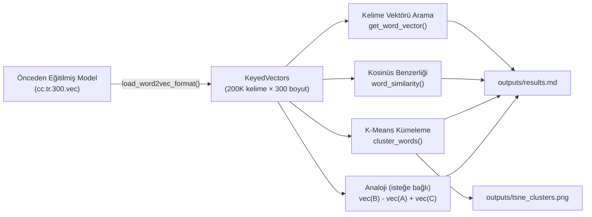
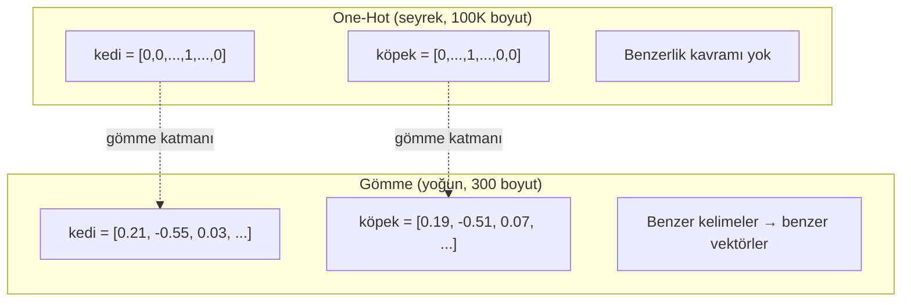
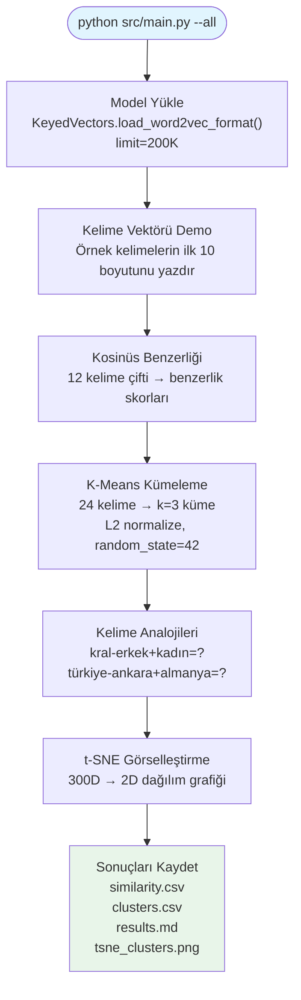

# Week 3: Türkçe Kelime Gömmeleri — FastText, Benzerlik & Kümeleme

Bu proje, önceden eğitilmiş Türkçe kelime gömme vektörlerini (FastText / GloVe) yükler, kelimeler arasında kosinüs benzerliği gösterir, ilgili kelimeleri K-Means kümeleme ile gruplar ve isteğe bağlı olarak kelime analojisi görevleri ile t-SNE görselleştirmesi çalıştırır. Ödevin çok ötesine geçerek şunları ekler:

- **25 kelime analojisi** 7 kategoride (cinsiyet, ülke-başkent, zıt anlamlılar, fiil zamanı vb.)
- **Resmi kıyaslama değerlendirmesi**: AnlamVer (500 çift), Türkçe anlamsal analojiler (7742 soru) ve sözdizimsel analojiler (206 soru)
- **5 model karşılaştırması**: FastText vs BERTurk vs XLM-RoBERTa vs Turkish BERT-NLI-STS vs Multilingual MiniLM
- **t-SNE görselleştirme** kümelenmiş kelimeler
- **16 dokümantasyon dosyası** (EN + TR): öğrenme hedefleri, değerlendirme metrikleri, sonuç analizi ve öz değerlendirme

---

## Nasıl Çalışır



---

## Temel Kavramlar

### Kelime Gömmeleri

Kelimeleri seyrek one-hot vektörler (sözlükteki her kelime için bir boyut) olarak temsil etmek yerine, kelime gömmeleri her kelimeyi **yoğun, düşük boyutlu bir vektöre** (genellikle 300 boyut) eşler; burada anlamsal benzerlik vektör yakınlığı ile yakalanır.



### Kosinüs Benzerliği

Kosinüs benzerliği iki vektör arasındaki açıyı ölçer, büyüklüklerini yok sayar. Bu gömmeler için idealdir çünkü kelime sıklığı vektör normlarını etkiler ve biz sıklıkla değil **anlamla** ilgileniyoruz.

```
cos(u, v) = (u · v) / (||u|| × ||v||)
```

| Aralık | Yorum |
|--------|-------|
| +1 | Aynı anlam |
| 0 | İlişkisiz |
| -1 | Zıt yön |

### K-Means Kümeleme

K-Means, her kelimeyi en yakın küme merkezine atayarak ve merkezleri yeniden hesaplayarak kelimeleri `k` gruba ayırır. Vektörleri önce L2 ile normalize ederiz, böylece Öklid mesafesi (K-Means'in kullandığı) kosinüs mesafesine eşdeğer olur.

### Kelime Analojileri

Gömmeler anlamsal ilişkileri yönler olarak kodlar. Klasik test:

```
vec("kral") - vec("erkek") + vec("kadın") ≈ vec("kraliçe")
```

---

## Türkçe İçin Neden FastText?

Türkçe **eklemeli** bir dildir — ekler zaman, kişi, durum ve iyelik kodlamak için üst üste binebilir:

```
kitap → kitabım → kitaplarımızda
(kitap)  (benim kitabım)  (bizim kitaplarımızda)
```

Bu devasa bir yüzey sözlüğü oluşturur. **FastText** bunu Word2Vec veya GloVe'dan daha iyi ele alır çünkü her kelimeyi **karakter n-gramlarının** toplamı olarak temsil eder — böylece görülmemiş kelime biçimleri için alt-kelime parçalarından vektör oluşturabilir.

> **Not:** Alt-kelime geri dönüşü yalnızca tam FastText modeli ile çalışır. Bu projede hız ve basitlik için `KeyedVectors` (yalnızca sözlük formatı) kullanıyoruz, bu nedenle OOV kelimeler oluşturulmuş bir vektör yerine `None` döndürür.

---

## Proje Yapısı

```
week3-embedding/
├── README.md                              ← İngilizce README
├── README_TR.md                           ← bu dosya
├── requirements.txt                       ← Python bağımlılıkları
├── .gitignore                             ← data/*.vec*, outputs/ hariç tutar
├── data/
│   ├── README.md                          ← indirme talimatları
│   ├── cc.tr.300.vec                      ← (commit edilmez — ~4.5 GB)
│   ├── anlamver_similarity.txt            ← AnlamVer kıyaslaması (500 çift)
│   ├── turkish-analogy-semantic.txt       ← 7742 anlamsal analoji sorusu
│   └── SynAnalogyTr.txt                   ← 206 sözdizimsel analoji sorusu
├── src/
│   ├── __init__.py
│   ├── embedding_utils.py                 ← temel fonksiyonlar (yükleme, benzerlik, kümeleme)
│   ├── main.py                            ← CLI giriş noktası
│   ├── evaluate.py                        ← kıyaslama değerlendirmesi (FastText)
│   └── evaluate_advanced.py               ← 5 model karşılaştırması
├── outputs/                               ← otomatik oluşturulan sonuçlar
│   ├── similarity.csv
│   ├── clusters.csv
│   ├── results.md
│   ├── tsne_clusters.png                  ← (--visualise ile)
│   ├── evaluation_report.md               ← kıyaslama sonuçları
│   └── model_comparison.md                ← 5 model karşılaştırma raporu
├── docs/
│   ├── HOMEWORK.md + _TR                  ← orijinal ödev
│   ├── LEARNING_OBJECTIVES.md + _TR       ← çalışma rehberi ve linkler
│   ├── EXTRA_SUGGESTIONS.md + _TR         ← uzantı fikirleri
│   ├── EVALUATION_METRICS.md + _TR        ← örneklerle metrik açıklamaları
│   ├── RESULTS_ANALYSIS.md + _TR          ← sonuçlarımızın yorumu
│   └── SELF_EVALUATION.md + _TR           ← gereksinim başına ne yaptık & öğrendik
└── scripts/                               ← yardımcı betikler
```

---

## Hızlı Başlangıç

### 1. Bağımlılıkları kurun

```bash
cd week3-embedding
python -m venv .venv && source .venv/bin/activate
pip install -r requirements.txt
```

### 2. FastText Türkçe modelini indirin

```bash
# ~1.2 GB indirme → ~4.5 GB sıkıştırılmamış
wget https://dl.fbaipublicfiles.com/fasttext/vectors-crawl/cc.tr.300.vec.gz
gunzip cc.tr.300.vec.gz
mv cc.tr.300.vec data/
```

Veya [fasttext.cc/docs/en/crawl-vectors.html](https://fasttext.cc/docs/en/crawl-vectors.html) adresinden Türkçe `.vec` dosyasını indirin.

### 3. Çalıştırın

```bash
# Temel: benzerlik + kümeleme (en sık 200K kelimeyi yükler)
python src/main.py

# Açık model yolu
python src/main.py --model data/cc.tr.300.vec

# Daha hızlı başlangıç için daha az kelime yükleyin
python src/main.py --limit 50000

# FastText yerine GloVe
python src/main.py --model data/glove.tr.300.txt --model-type glove

# Analojilerle
python src/main.py --analogy

# t-SNE görselleştirmesiyle
python src/main.py --visualise

# Her şey
python src/main.py --all

# Özel küme sayısı
python src/main.py --k 5 --all
```

---

## Boru Hattı Genel Bakış



---

## Çıktı Dosyaları

| Dosya | Açıklama |
|-------|----------|
| `outputs/similarity.csv` | CSV formatında kelime çifti benzerlik skorları |
| `outputs/clusters.csv` | Her kelime ve küme ataması |
| `outputs/results.md` | Tüm sonuçlarla tam Markdown raporu |
| `outputs/tsne_clusters.png` | Kümelenmiş kelimelerin 2D dağılım grafiği (`--visualise` ile) |
| `outputs/evaluation_report.md` | Resmi kıyaslama sonuçları (AnlamVer, analojiler, kümeleme) |
| `outputs/model_comparison.md` | Kategori bazında ayrıntılı 5 model karşılaştırma raporu |

---

## API Referansı

### `embedding_utils.py`

| Fonksiyon | İmza | Döndürür |
|-----------|------|----------|
| `load_fasttext_model` | `(path: str, limit: int = 200_000)` | `KeyedVectors` |
| `load_glove_model` | `(path: str, limit: int = 200_000)` | `KeyedVectors` |
| `get_word_vector` | `(model, word: str)` | `np.ndarray \| None` |
| `word_similarity` | `(model, word1: str, word2: str)` | `float` (OOV ise NaN) |
| `cluster_words` | `(model, words: list[str], k: int = 3)` | `dict[str, int]` |

Tüm fonksiyonlar OOV durumunu zarif biçimde ele alır — çökme yok, sadece `None` veya `NaN`.

---

## Temel Tasarım Kararları

1. **Tam model yerine `KeyedVectors`:** Yalnızca sözlük vektörlerini yüklemek ~600 MB RAM kullanır (200K sınırıyla); tam FastText modeli ~8 GB gerektirir. Ödünleşme, OOV kelimeler için alt-kelime geri dönüşünü kaybetmektir.

2. **K-Means öncesi L2 normalizasyonu:** K-Means Öklid mesafesini kullanır. Ham gömme vektörlerinde bu, yönü (anlam) büyüklükle (sıklık) karıştırır. L2 normalizasyonu Öklid mesafesini kosinüs mesafesine eşdeğer kılar.

3. **`limit=200_000`:** Tam FastText Türkçe dosyasında ~2M kelime var. Çoğu çöp (URL'ler, yazım hataları, nadir çekimler). İlk 200K yararlı sözlüğü kaplar ve yükleme süresini 30 saniyenin altında tutar.

4. **Türkçe normalizasyonu için `casefold()`:** Python'un `casefold()` fonksiyonu Türkçeye özgü harf dönüşümünü doğru ele alır (`İ` → `i`, `I` → `ı`), `lower()` fonksiyonunun aksine.

---

## Kıyaslama Değerlendirmesi

`main.py`'deki niteliksel kontrollerin ötesinde, `evaluate.py` ve `evaluate_advanced.py` ile resmi kıyaslamalar çalıştırdık.

### FastText Sonuçları (limit=200K)

| Kıyaslama | Metrik | Skor |
|-----------|--------|------|
| AnlamVer (500 çift) | Spearman ρ | **0.571** |
| Anlamsal Analojiler (7742) | Top-5 Doğruluk | **%65.1** |
| Sözdizimsel Analojiler (206) | Top-5 Doğruluk | **%69.8** |
| Kümeleme (90 kelime, k=5) | ARI | **0.949** |

### 5 Model Karşılaştırması

| Model | Tip | AnlamVer ρ | Anl. Top-5 | Söz. Top-5 | ARI |
|-------|-----|-----------|-----------|-----------|-----|
| **FastText cc.tr.300** | Statik | **0.571** | **%65.1** | %69.8 | **0.949** |
| BERTurk | Bağlamsal | 0.356 | %18.1 | %75.2 | 0.419 |
| XLM-RoBERTa | Bağlamsal | 0.014 | %7.8 | %50.5 | 0.020 |
| **Turkish BERT-NLI-STS** | Cümle-TR | 0.514 | %22.4 | **%98.5** | 0.697 |
| Multilingual MiniLM | Cümle-TR | 0.265 | %14.6 | %84.0 | 0.271 |

**Temel bulgu:** Evrensel olarak "en iyi" model yoktur. FastText kelime-düzeyi görevlere hükmeder. Turkish BERT-NLI-STS sözdizimsel/morfolojik görevlere hükmeder. Ham BERT/RoBERTa tek-kelime görevlerinde kötü performans gösterir çünkü cümle bağlamına ihtiyaç duyarlar. Tam yorum için `docs/RESULTS_ANALYSIS_TR.md`'ye bakın.

### Değerlendirmeleri çalıştırma

```bash
# FastText kıyaslama değerlendirmesi
python src/evaluate.py

# 5 model karşılaştırması (transformers + sentence-transformers gerektirir)
pip install transformers sentence-transformers torch
python src/evaluate_advanced.py
```

---

## Kaynaklar

### Kelime Gömmeleri — Teori

- [Jay Alammar — The Illustrated Word2Vec](https://jalammar.github.io/illustrated-word2vec/) — en iyi görsel giriş
- [Stanford CS224N — Word Vectors](https://www.youtube.com/watch?v=rmVRLeJRkl4) — Chris Manning dersi
- [StatQuest — Word Embeddings](https://www.youtube.com/watch?v=viZrOnJclY0) — sezgisel 15 dakikalık açıklama

### Makaleler

- [Mikolov ve ark., 2013 — Word2Vec](https://arxiv.org/abs/1301.3781)
- [Pennington ve ark., 2014 — GloVe](https://nlp.stanford.edu/pubs/glove.pdf)
- [Bojanowski ve ark., 2017 — FastText](https://arxiv.org/abs/1607.04606)

### Önceden Eğitilmiş Modeller

- [FastText — 157 dil için önceden eğitilmiş vektörler](https://fasttext.cc/docs/en/crawl-vectors.html) — `cc.tr.300.vec.gz` indirin
- [GloVe — Stanford NLP](https://nlp.stanford.edu/projects/glove/)

### Kütüphaneler

- [Gensim — KeyedVectors](https://radimrehurek.com/gensim/models/keyedvectors.html) — gömmeleri yükleme ve sorgulama
- [scikit-learn — KMeans](https://scikit-learn.org/stable/modules/generated/sklearn.cluster.KMeans.html)
- [scikit-learn — cosine_similarity](https://scikit-learn.org/stable/modules/generated/sklearn.metrics.pairwise.cosine_similarity.html)
- [scikit-learn — t-SNE](https://scikit-learn.org/stable/modules/manifold.html#t-sne)

### Türkçe NLP

- [Zeyrek — Türkçe morfolojik analizci](https://github.com/obulat/zeyrek)
- [Zemberek-NLP](https://github.com/ahmetaa/zemberek-nlp) — kapsamlı Türkçe NLP araç seti

### Görselleştirme

- [Distill.pub — t-SNE'yi Etkili Kullanma](https://distill.pub/2016/misread-tsne/) — temel okuma
- [Google Embedding Projector](https://projector.tensorflow.org/) — interaktif 3D keşif

---

## Notlar

- Gömme dosyası (`cc.tr.300.vec`) ~4.5 GB'dır ve git'e **commit edilmez**. İndirme talimatları için `data/README.md`'ye bakın.
- 200K kelime yüklemek ~20-30 saniye sürer. İlk çalıştırmada sabırlı olun.
- Sonuçlar hangi modeli kullandığınıza ve `limit` parametresine bağlıdır. Daha yüksek sınırlar daha iyi kapsam sağlar ama daha fazla RAM kullanır ve daha yavaş yükler.
- Gensim `.gz` dosyalarını doğrudan okuyabilir (sıkıştırmayı açmaya gerek yok), ancak sıkıştırılmamış dosyalar ~3 kat daha hızlı yüklenir.

---

*Bu proje, kelime gömmeleri, kosinüs benzerliği ve denetimsiz kümeleme üzerine bir ders ödevi kapsamında oluşturulmuştur.*
