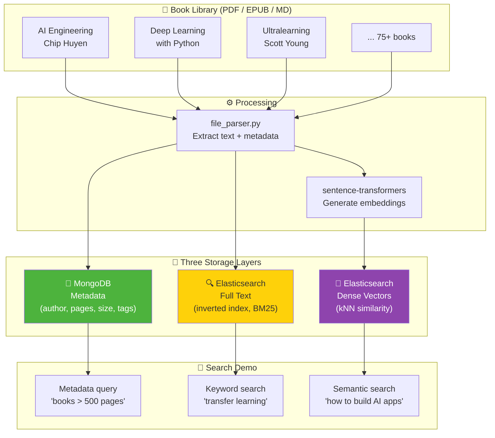

# Week 4: Document Ingestion Pipeline — MongoDB + Elasticsearch + Vector Search

Store files from a folder in three complementary systems: metadata in MongoDB, full text in Elasticsearch, and dense vector embeddings for semantic search. This is the storage layer that every RAG application needs.

---

## Pipeline Architecture



## Why Three Systems?

| System | Stores | Good at | Fails at |
|--------|--------|---------|----------|
| **MongoDB** | Structured metadata | Filtering by author, size, date, tags | Cannot search inside text content |
| **Elasticsearch** | Full text (inverted index) | Finding exact words and phrases | Cannot find semantically similar content |
| **Elasticsearch (dense_vector)** | Dense embeddings | Finding content by meaning | Cannot do exact phrase matching |

A production RAG system uses **all three together**: filter by metadata, rank by keyword relevance, re-rank by semantic similarity.

---

## Quick Start

### 1. Start the databases (Docker)

```bash
# MongoDB
docker run -d --name mongo -p 27017:27017 mongo:latest

# Elasticsearch (single-node, no auth for local dev)
docker run -d --name elasticsearch \
  -p 9200:9200 \
  -e "discovery.type=single-node" \
  -e "xpack.security.enabled=false" \
  -e "ES_JAVA_OPTS=-Xms512m -Xmx512m" \
  elasticsearch:8.17.0
```

### 2. Install Python dependencies

```bash
cd VBO_AI_Engineering/week4-vectorization
python3 -m venv .venv
source .venv/bin/activate
pip install -r requirements.txt
```

### 3. Run the pipeline

```bash
# Ingest all books into all three systems
python run.py --ingest

# Run the search comparison demo
python run.py --search "How do I build an AI application?"

# Run all demo queries and generate report
python run.py --demo
```

---

## Project Structure

```
week4-vectorization/
├── run.py                 ← Main entry point (v1: ingest/search/demo, v2: ingest-v2/search-v2/compare)
├── config.py              ← Paths, model name, chunk size, threshold, connections
├── requirements.txt
├── README.md              ← This file (English)
├── README_TR.md           ← Turkish version
├── GUIDE.md               ← Step-by-step homework guide (English)
├── LEARNING.md            ← What to learn + reading links (English)
├── LEARNING_TR.md         ← Turkish version
├── SELF_EVALUATION.md     ← Self-assessment + instructor feedback
├── src/
│   ├── file_parser.py     ← Extract text + metadata + SHA-256 hash from PDF/EPUB/MD
│   ├── mongo_store.py     ← MongoDB metadata operations (hash-based upsert)
│   ├── elastic_store.py   ← Elasticsearch text indexing + BM25 search
│   ├── vector_store.py    ← Embedding generation + kNN search
│   ├── chunker.py         ← Text chunking with overlap (v2)
│   ├── hybrid_store.py    ← Combined text+vector index + RRF hybrid search (v2)
│   └── search_demo.py     ← Side-by-side comparison of all 3 systems
└── outputs/
    └── search_comparison.md  ← Auto-generated comparison report + instructor feedback
```

## Data Source

The pipeline reads from `~/Desktop/week_4_researchs/` — a personal library of 78 books and papers covering AI, data science, algorithms, career development, and more. File formats: PDF, EPUB, AZW3.

---

## Key Concepts Practised

- Document parsing (PDF, EPUB) and text extraction
- NoSQL document storage (MongoDB)
- Full-text search with inverted indexes (Elasticsearch + BM25)
- Dense vector embeddings (sentence-transformers)
- Approximate nearest neighbour search (Elasticsearch kNN)
- Comparing keyword search vs semantic search results

## What Comes Next

This pipeline is the **retrieval** half of RAG. In Week 5–6, you will connect it to an LLM so it can **generate** answers grounded in your documents.

---

## Author

Built by Yetkin Eser — VBO AI & LLM Bootcamp, Week 4 (April 2026).
