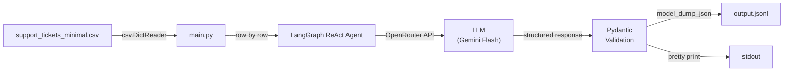
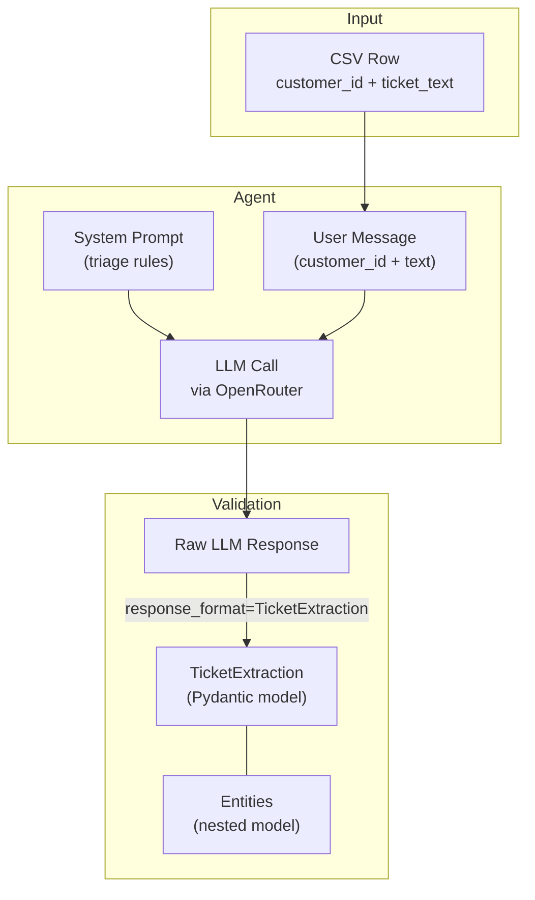
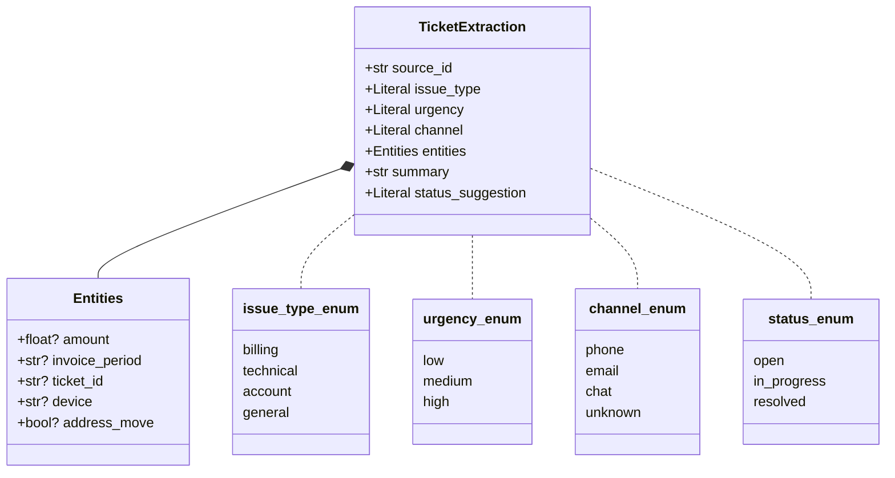

# Week 5 — Structured Output Agent

Reads Turkish telecom support tickets from a CSV file, sends each one to an LLM agent via LangChain/LangGraph, and extracts structured triage data (issue type, urgency, channel, entities) validated by Pydantic. Results are written to `output.jsonl` — one JSON object per line.

## Pipeline Overview



## Data Flow per Ticket



## Schema Structure



## Setup

```bash
cp .env.example .env
# Edit .env and add your OpenRouter API key
```

## Run

```bash
uv run python main.py support_tickets_minimal.csv
```

Output is written to `output.jsonl` and printed to stdout.

## Project Structure

```
week5-structured-output/
├── main.py                         # Agent pipeline script
├── support_tickets_minimal.csv     # Input: 8 Turkish telco tickets
├── output.jsonl                    # Output: one JSON object per line
├── homework.md                     # Assignment description
├── learning.md                     # Concepts & learning resources
├── pyproject.toml                  # uv project config
├── .env.example                    # API key template
└── .gitignore
```
