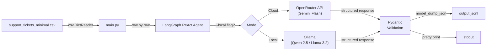
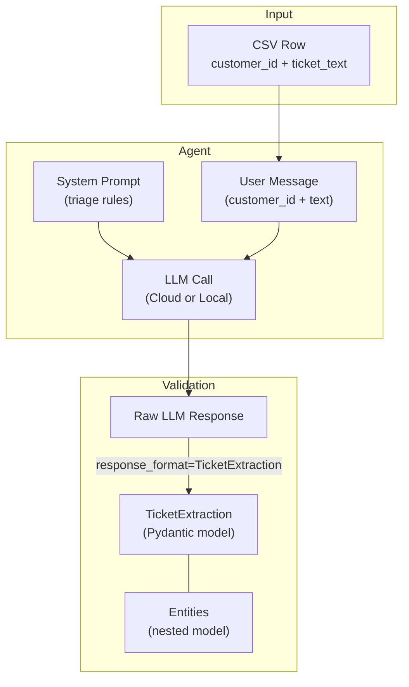
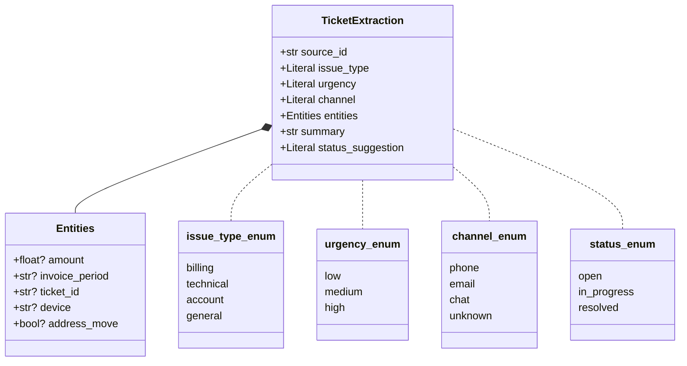

# Week 5 — Structured Output Agent

Reads Turkish telecom support tickets from a CSV file, sends each one to an LLM agent via LangChain/LangGraph, and extracts structured triage data (issue type, urgency, channel, entities) validated by Pydantic. Results are written to JSONL — one JSON object per line.

Tested with **3 models** (1 cloud + 2 local). See [model_comparison.md](model_comparison.md) for detailed results.

## Pipeline Overview



## Data Flow per Ticket



## Schema Structure



## Model Comparison

| Model | Type | Size | Accuracy | Hallucinations | Cost |
|---|---|---|---|---|---|
| Gemini 2.0 Flash | Cloud (OpenRouter) | N/A | 6/8 | 2 | ~$0.002/run |
| Llama 3.2 | Local (Ollama) | 3B | 7.5/8 | 0 | Free |
| **Qwen 2.5** | **Local (Ollama)** | **14B** | **8/8** | **0** | **Free** |

Local models outperformed the cloud model on this task — zero hallucinations and better extraction accuracy. See [model_comparison.md](model_comparison.md) for ticket-by-ticket breakdown.

## Setup

### Cloud mode (OpenRouter)

```bash
cp .env.example .env
# Edit .env and add your OpenRouter API key
```

### Local mode (Ollama)

```bash
# Install Ollama from https://ollama.com
ollama pull qwen2.5:14b    # Best accuracy (9 GB)
# or
ollama pull llama3.2        # Lighter alternative (2 GB)
```

## Run

```bash
# Cloud mode (Gemini Flash via OpenRouter)
uv run python main.py support_tickets_minimal.csv

# Local mode (Ollama — default: qwen2.5:14b)
uv run python main.py support_tickets_minimal.csv --local

# Local mode with a different model
OLLAMA_MODEL=llama3.2 uv run python main.py support_tickets_minimal.csv --local
```

## Output Files

| File | Model | Description |
|---|---|---|
| `output.jsonl` | Gemini 2.0 Flash | Cloud model output |
| `output_local.jsonl` | Qwen 2.5 14B | Best local model output |

## Project Structure

```
week5-structured-output/
├── main.py                         # Agent pipeline script
├── support_tickets_minimal.csv     # Input: 8 Turkish telco tickets
├── output.jsonl                    # Output: cloud model (Gemini Flash)
├── output_local.jsonl              # Output: local model (Qwen 2.5)
├── model_comparison.md             # 3-model comparison with scorecard
├── self_evaluation.md              # Homework self-evaluation
├── homework.md                     # Assignment description
├── learning.md                     # Concepts & learning resources
├── pyproject.toml                  # uv project config
├── .env.example                    # API key template
└── .gitignore
```
