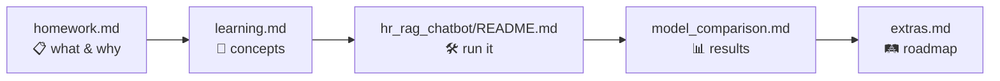

# Week 6 — RAG Chatbot with Short-Term Memory

HR-policy RAG chatbot built on LangChain 1.x `create_agent`, Chroma persistent vectors, and a Postgres-backed `PostgresSaver` checkpointer. Three chat-model profiles (Gemini / DeepSeek / Ollama) for side-by-side comparison.

## Documents in this folder

| File | Purpose |
|---|---|
| [`homework.md`](homework.md) | Assignment brief — what, why, with reference links per task |
| [`learning.md`](learning.md) | Concepts taught + reading list (RAG paper, chunking, persistence) |
| [`model_comparison.md`](model_comparison.md) | 3-model benchmark with mermaid + per-question breakdown |
| [`extras.md`](extras.md) | Beyond-spec additions (3 profiles, scorer.py) + roadmap (reranker, RAGAS, GraphRAG) |
| [`hr_rag_chatbot/`](hr_rag_chatbot/) | The actual code — ingest, agent, CLI, scorer |

## Reading order

## TL;DR results

| Model | smoke | memory | cite | hallu | latency |
|---|:---:|:---:|:---:|:---:|:---:|
| 🥇 **gemini-2.5-flash-lite** (spec) | 6/6 | 3/3 | 9/9 | **0** | **1.8s** |
| 🥈 deepseek-chat | 5/6 | 3/3 | 8/9 | **0** | 4.84s |
| 🥉 qwen2.5:14b (Ollama) | 6/6\* | 2/3 | 8/9 | **8** | 7.57s |

Full breakdown: [`model_comparison.md`](model_comparison.md). \* Ollama smoke 6/6 sayar non-empty cevapları — gerçek kalitede `hallu_cite=8` ve `lang_consistency=3/9`'a bakılmalı.
