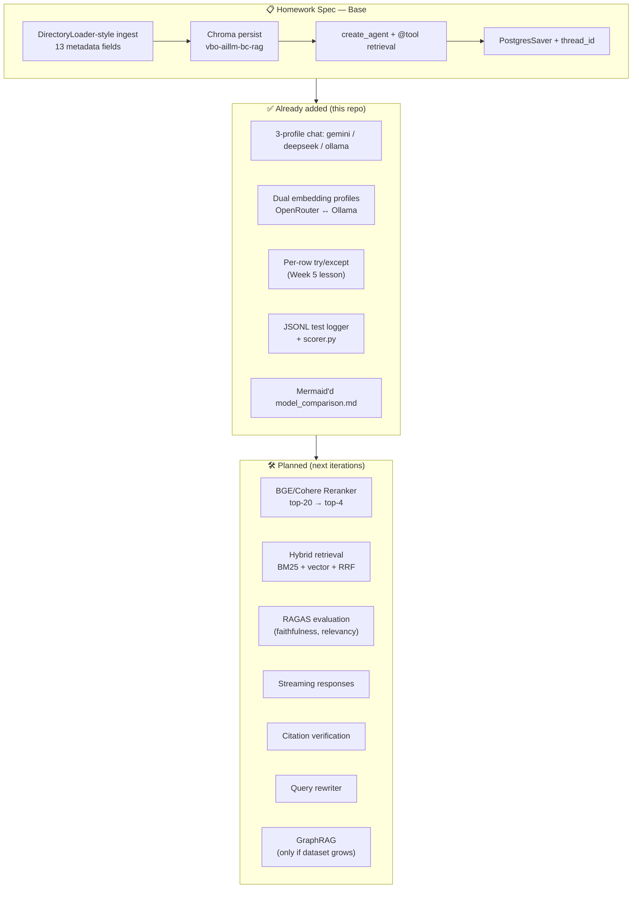
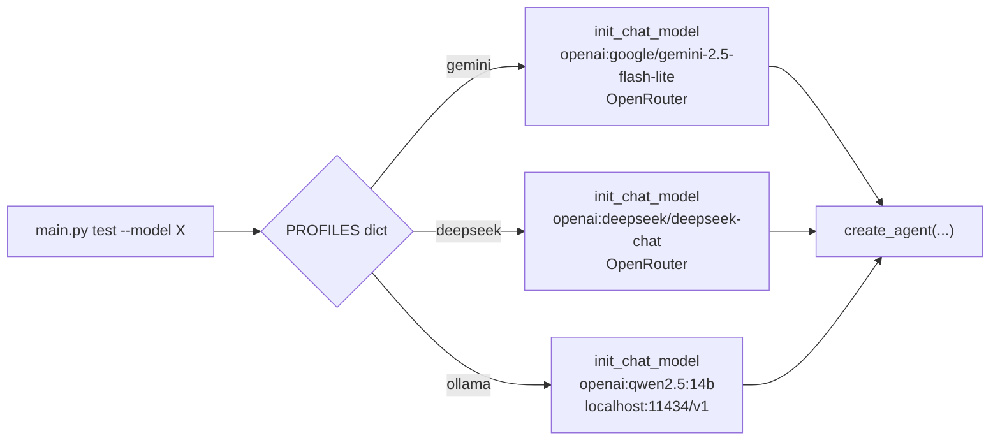
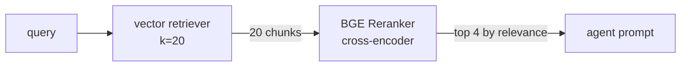
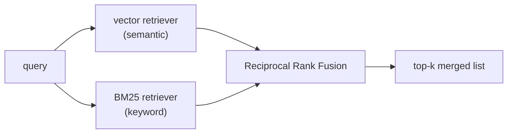
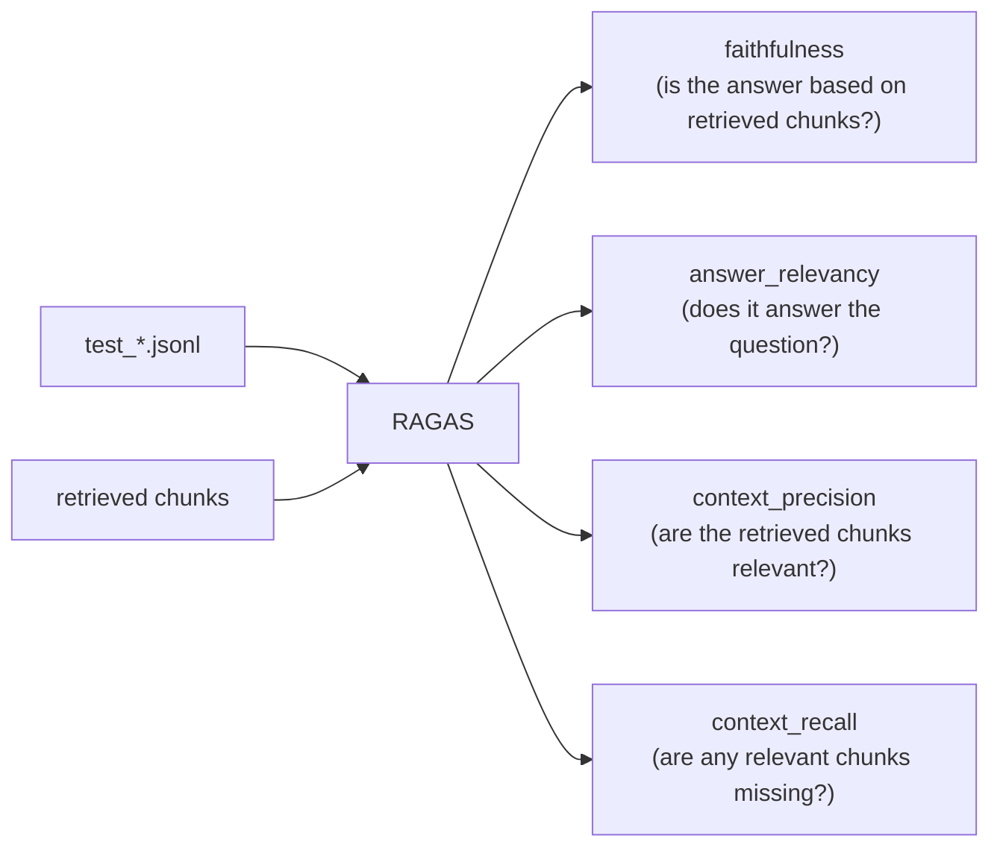

# Week 6 — Extras (Beyond the Spec + Roadmap)

The base homework lives under [`hr_rag_chatbot/`](hr_rag_chatbot/) — `main.py ingest` + `main.py chat` runs the spec-compliant pipeline. This file lists **what was added on top of the base** and **what comes next**. The Week 5 `--local` + `model_comparison.md` pattern was carried into Week 6 and made wider.

---

## Architecture Overview



---

## ✅ What was added on top of the base

### 1. `--model {gemini,deepseek,ollama}` profiles

The spec only requires Gemini. In [`rag_agent.py:30-34`](hr_rag_chatbot/rag_agent.py#L30-L34) a `PROFILES` dict wires three different models behind a single agent:



**Why this matters:** the same code, system prompt, and retriever — only the chat model changes. This isolates "model quality" as the single variable in the comparison (this is called **single-variable ablation** in the literature, see [BAIR's LLM eval guide](https://bair.berkeley.edu/blog/2023/04/03/koala/)).

### 2. Two embedding profiles (OpenRouter ↔ Ollama)

[`vector_store.py:42-58`](hr_rag_chatbot/vector_store.py#L42-L58) has an `_embeddings(profile)` switch:

| Profile | Embedding | Dim | Collection |
|---|---|---|---|
| `openrouter` (spec) | `openai/text-embedding-3-small` | 1536 | `vbo-aillm-bc-rag` |
| `ollama` | `nomic-embed-text` | 768 | `vbo-aillm-bc-rag-ollama` |

**Why two collections?** Chroma rejects writes whose vector dimension does not match the collection. If you try to write two vectors of different sizes into the same collection, you get `ValueError: Embedding dimension X does not match collection dimensionality Y`.

### 3. Per-row try/except + retry (Week 5 lesson)

In [`main.py:100-119`](hr_rag_chatbot/main.py#L100-L119) the test loop wraps each question in try/except — if one question crashes, the others keep running and the error gets logged to JSONL. This is the natural follow-up to the `-1p` deduction in Week 5 [`feedback.md`](../week5-structured-output/feedback.md).

In the Ollama test, memory turn 3 raised a `KeyError` — the pipeline did not crash, the error landed in the JSONL, and `scorer.py` correctly reported `memory_ok=2/3`.

### 4. JSONL test logger + scorer.py

Each test run produces `results/test_<model>.jsonl` with one record per turn:
```json
{"model": "gemini", "section": "smoke", "question": "...", "answer": "...",
 "ok": true, "latency_s": 1.69, "timestamp": "..."}
```

`scorer.py` prints six metrics: `smoke_ok`, `memory_ok`, `cite_rate`, `hallu_cite`, `lang_consistency`, `avg_latency_s`. **`hallu_cite` and `lang_consistency` are the most useful two** — they catch Ollama's real failures even when `smoke_ok=6/6` looks fine on paper.

The JSONL format is the standard [JSON Lines](https://jsonlines.org/) format — append-friendly and parsable line by line.

### 5. 3-Model comparison report

[`model_comparison.md`](model_comparison.md): a Week 5–style writeup with tables, a per-question breakdown, and a technical analysis of why Ollama broke (with a [Berkeley Function-Calling Leaderboard](https://gorilla.cs.berkeley.edu/leaderboard.html) reference).

---

## 🛠️ Planned additions

### 1. Reranker (BGE or Cohere)



**Why:** vector retrieval ranks results by similarity, but "two vectors are close" is not the same as "they answer the question equally well". A cross-encoder reranker scores the `(query, chunk)` pair together and produces a real relevance score. This is **the single biggest cheap win** in the literature — [Pinecone's benchmark](https://www.pinecone.io/learn/series/rag/rerankers/) shows Recall@4 going up by 15-30%.

LangChain integration: [`ContextualCompressionRetriever` + `CrossEncoderReranker`](https://python.langchain.com/docs/integrations/retrievers/bge-rerank/). HuggingFace's [`BAAI/bge-reranker-base`](https://huggingface.co/BAAI/bge-reranker-base) is free and runs locally.

### 2. Hybrid Retrieval (BM25 + Vector + RRF)



**Why:** embeddings catch semantic similarity but often miss exact matches. Tokens like "Section 4.2" or "TKT-88123" get diluted in the vector space. BM25 (keyword TF-IDF) fills that gap. [Reciprocal Rank Fusion](https://plg.uwaterloo.ca/~gvcormac/cormacksigir09-rrf.pdf) merges the two ranked lists into a single score.

LangChain ships this out of the box with [`EnsembleRetriever`](https://python.langchain.com/docs/how_to/ensemble_retriever/).

### 3. RAGAS Evaluation Harness



**Why:** the manual "PASS/FAIL" notes in `model_comparison.md` are subjective. [RAGAS](https://docs.ragas.io/) automates these four metrics using LLM-as-judge — so you can defend the homework with "the RAGAS faithfulness score is 0.87" instead of "I read it and it looks fine". The 3-model comparison gets a scientific basis.

Paper: [Es et al., 2023 — RAGAS](https://arxiv.org/abs/2309.15217).

### 4. Streaming Responses

[`agent.stream()`](https://python.langchain.com/docs/how_to/streaming/) emits tokens one by one. The CLI experience improves immediately — Gemini Flash already averages 1.8s, but with streaming the perceived latency drops to half because the user starts reading right away.

### 5. Citation Verification

For every answer, **verify the citation after the fact** — check that the claim actually comes from a chunk in the cited `file_name`. This catches Ollama's hallucinated `employee_benefits_policy.docx` automatically.

The pattern is the reverse of [Anthropic's Citations API](https://docs.anthropic.com/en/docs/build-with-claude/citations) — the model produces a citation, and you verify it against the vector store.

### 6. Query Rewriter (Multi-Query Expansion)

In memory turn 2, `"What about sick leave?"` worked on Gemini because Gemini paraphrased it well internally. Ollama failed there because it skipped that step. A **pre-retrieval rewrite** runs a small LLM call to do pronoun resolution and produce 3 paraphrases, then merges the retrieval results from all of them.

LangChain has this as [`MultiQueryRetriever`](https://python.langchain.com/docs/how_to/MultiQueryRetriever/).

### 7. Knowledge Graph (only if the dataset grows)

The user asked about this — for the current data, a knowledge graph is **overkill**. There are 8 short policy docs, all on independent topics. Vector RAG is enough.

KG would shine in scenarios like:
- Employee → manager → dept → policy → approval chains (multi-hop)
- "Who is the manager of the person who approves travel?"
- Cross-policy references (policy X cites policy Y)

Canonical references: [Microsoft GraphRAG](https://github.com/microsoft/graphrag), [LangChain GraphRAG integration](https://python.langchain.com/docs/integrations/graphs/), [Neo4j + LangChain](https://neo4j.com/labs/genai-ecosystem/langchain/).

---

## Value Ranking (highest to lowest)

| # | Addition | Impact | Effort | Working example available? |
|---|---|:---:|:---:|:---:|
| 1 | RAGAS eval | 🔴🔴🔴 | 1h | [docs](https://docs.ragas.io/en/stable/getstarted/evals/) |
| 2 | Reranker (BGE) | 🔴🔴🔴 | 30m | [LangChain how-to](https://python.langchain.com/docs/integrations/retrievers/bge-rerank/) |
| 3 | Hybrid retrieval | 🔴🔴 | 1h | [EnsembleRetriever](https://python.langchain.com/docs/how_to/ensemble_retriever/) |
| 4 | Citation verify | 🔴🔴 | 45m | none — needs to be written |
| 5 | Query rewriter | 🔴🔴 | 30m | [MultiQueryRetriever](https://python.langchain.com/docs/how_to/MultiQueryRetriever/) |
| 6 | Streaming | 🔴 | 20m | [agent.stream()](https://python.langchain.com/docs/how_to/streaming/) |
| 7 | GraphRAG | 🔴 (for this data) | 4h+ | [Microsoft GraphRAG](https://github.com/microsoft/graphrag) |

---

## General References

- [LangChain RAG tutorial](https://python.langchain.com/docs/tutorials/rag/) — canonical
- [LangChain Retrievers concept](https://python.langchain.com/docs/concepts/retrievers/)
- [Pinecone — Chunking & Reranking series](https://www.pinecone.io/learn/series/rag/)
- [Anthropic — Contextual Retrieval](https://www.anthropic.com/news/contextual-retrieval)
- [Lewis et al., 2020 — RAG paper](https://arxiv.org/abs/2005.11401)
- [Es et al., 2023 — RAGAS paper](https://arxiv.org/abs/2309.15217)
- [Microsoft GraphRAG paper](https://arxiv.org/abs/2404.16130)
- [Berkeley Function-Calling Leaderboard](https://gorilla.cs.berkeley.edu/leaderboard.html)
