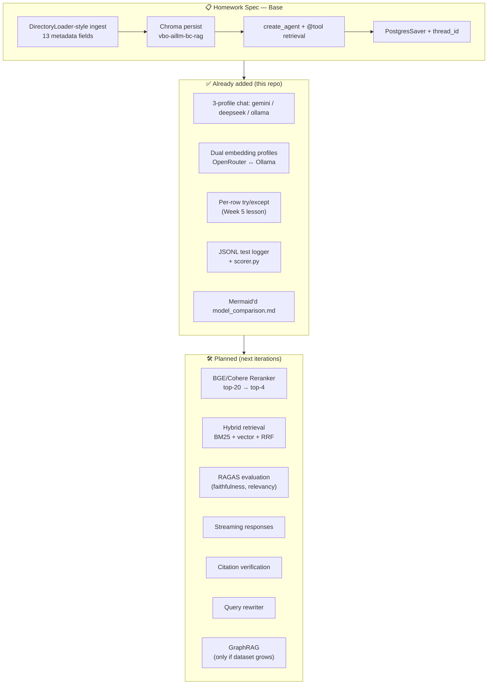
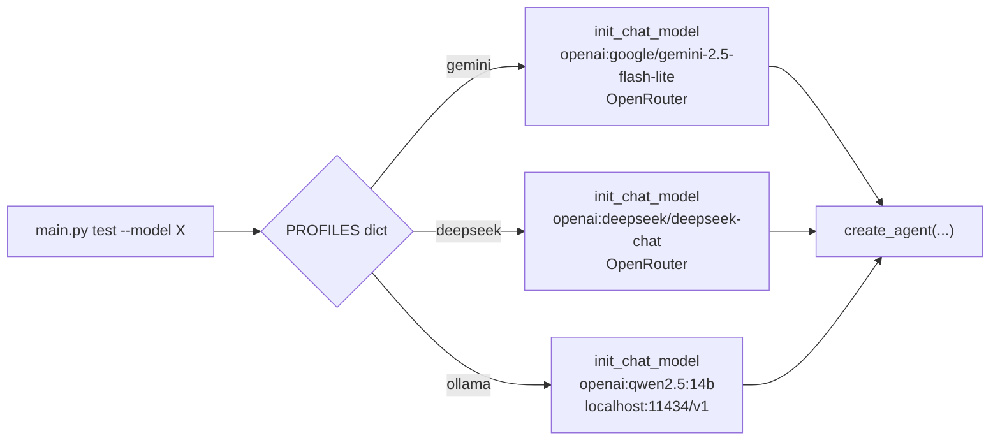
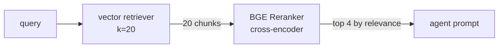
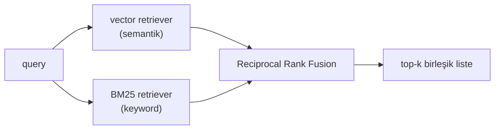
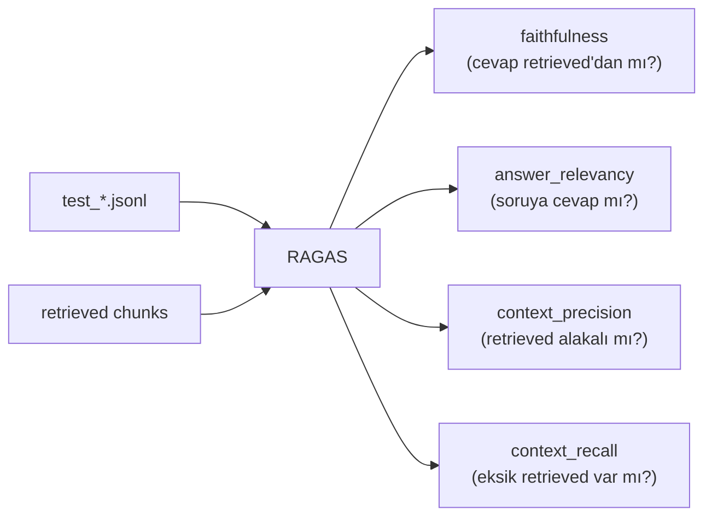

# Week 6 — Extras (Spec'in Üstüne Yapılanlar + Yol Haritası)

Spec'i karşılayan **base ödev** [`hr_rag_chatbot/`](hr_rag_chatbot/) altında — `main.py ingest` + `main.py chat` ile çalışır. Bu dosya **base'in üstüne ne eklendi** ve **sırada ne var** sorusunu cevaplıyor. Week 5'te yaptığın `--local` + `model_comparison.md` pattern'i Week 6'da daha kapsamlı hale getirildi.

---

## Mimari Genel Görünüm



---

## ✅ Şu ana kadar eklenenler

### 1. `--model {gemini,deepseek,ollama}` profilleri

Spec sadece Gemini istiyor. [`rag_agent.py:30-34`](hr_rag_chatbot/rag_agent.py#L30-L34)'te `PROFILES` dict ile üç model arkasını bağladım:



**Neden değer:** Aynı kod, aynı sistem prompt, aynı retriever — sadece chat modeli değişiyor. Bu sayede karşılaştırma "model kalitesi" değişkenini izole ediyor (literatürde **single-variable ablation** denir, [BAIR'ın LLM eval guide'ı](https://bair.berkeley.edu/blog/2023/04/03/koala/) buna vurgu yapar).

### 2. İki embedding profili (OpenRouter ↔ Ollama)

[`vector_store.py:42-58`](hr_rag_chatbot/vector_store.py#L42-L58)'de `_embeddings(profile)` switch'i:

| Profile | Embedding | Dim | Koleksiyon |
|---|---|---|---|
| `openrouter` (spec) | `openai/text-embedding-3-small` | 1536 | `vbo-aillm-bc-rag` |
| `ollama` | `nomic-embed-text` | 768 | `vbo-aillm-bc-rag-ollama` |

**Neden iki koleksiyon?** Chroma dim-mismatched yazımı reddeder. Aynı koleksiyona iki farklı boyutta vektör koymaya çalışırsan `ValueError: Embedding dimension X does not match collection dimensionality Y`.

### 3. Per-row try/except + retry (Week 5 dersi)

[`main.py:100-119`](hr_rag_chatbot/main.py#L100-L119)'da test loop'u her sorunun çevresini try/except ile sarıyor — bir soru çökse diğerleri devam eder, hata JSONL'e yazılır. Week 5 [`feedback.md`](../week5-structured-output/feedback.md)'te aldığın `-1p`'nin doğal devamı.

Ollama testinde memory turn 3 `KeyError` attı — pipeline çökmedi, JSONL'e error olarak düştü. Bu sayede `scorer.py` hatayı görüp `memory_ok=2/3` bastı.

### 4. JSONL test logger + scorer.py

Her test runı `results/test_<model>.jsonl` üretiyor — her satır:
```json
{"model": "gemini", "section": "smoke", "question": "...", "answer": "...",
 "ok": true, "latency_s": 1.69, "timestamp": "..."}
```

`scorer.py` 6 metrik basıyor: `smoke_ok`, `memory_ok`, `cite_rate`, `hallu_cite`, `lang_consistency`, `avg_latency_s`. **`hallu_cite` ve `lang_consistency` özellikle değerli** — `smoke_ok=6/6` çıktığı halde Ollama'nın gerçekten broken olduğunu yakalayan iki metrik bunlar.

JSONL formatı [JSON Lines](https://jsonlines.org/) standardı — append-friendly, her satır bağımsız parse edilir.

### 5. 3-Model karşılaştırma raporu

[`model_comparison.md`](model_comparison.md): Week 5 stilinde tablolar + per-question breakdown + Ollama'nın neden battığının teknik analizi ([Berkeley Function-Calling Leaderboard](https://gorilla.cs.berkeley.edu/leaderboard.html) referansıyla).

---

## 🛠️ Planlanan eklemeler

### 1. Reranker (BGE veya Cohere)



**Neden:** Vector retrieval similarity'den sıralı geliyor, ama "iki vector birbirine yakın" ≠ "ikisi soruyu eşit iyi cevaplar". Cross-encoder reranker `(query, chunk)` çiftine birlikte bakıp gerçek alaka skoru üretir. **Tek en büyük ucuz kazanç** literatürde — [Pinecone'un benchmark'ında](https://www.pinecone.io/learn/series/rag/rerankers/) Recall@4 %15-30 artıyor.

LangChain entegrasyonu: [`ContextualCompressionRetriever` + `CrossEncoderReranker`](https://python.langchain.com/docs/integrations/retrievers/bge-rerank/). HuggingFace'deki [`BAAI/bge-reranker-base`](https://huggingface.co/BAAI/bge-reranker-base) ücretsiz, lokalde çalışır.

### 2. Hybrid Retrieval (BM25 + Vector + RRF)



**Neden:** Embeddings semantik benzerliği yakalar ama exact-match'leri sıklıkla kaçırır. "Section 4.2" veya "TKT-88123" gibi tokenler vector space'de seyreltir. BM25 (keyword TF-IDF) o boşluğu doldurur. [Reciprocal Rank Fusion](https://plg.uwaterloo.ca/~gvcormac/cormacksigir09-rrf.pdf) iki listeyi tek skorla birleştirir.

LangChain'de [`EnsembleRetriever`](https://python.langchain.com/docs/how_to/ensemble_retriever/) bunu out-of-the-box veriyor.

### 3. RAGAS Evaluation Harness



**Neden:** Şu an `model_comparison.md`'deki manuel "PASS/FAIL" gözlemi sübjektif. [RAGAS](https://docs.ragas.io/) bu dört metriği LLM-as-judge ile otomatikleştiriyor — ödevi "Yetkin gözüyle iyi" değil "RAGAS skoru 0.87" diye savunabilirsin. Aynı 3-model karşılaştırması bilimsel zemine oturur.

Paper: [Es et al., 2023 — RAGAS](https://arxiv.org/abs/2309.15217).

### 4. Streaming Responses

[`agent.stream()`](https://python.langchain.com/docs/how_to/streaming/) ile token-by-token. CLI experience anında iyileşir, Gemini flash zaten 1.8s ortalama — streaming'le hissedilen latency yarıya iner.

### 5. Citation Verification

Her cevabın citation'ını **post-hoc doğrula** — claim'in `file_name` içindeki bir chunk'tan geldiğini kontrol et. Ollama'nın hayali `employee_benefits_policy.docx` halüsinasyonunu otomatik yakalar.

Pattern: [Anthropic'in Citations API'sinin](https://docs.anthropic.com/en/docs/build-with-claude/citations) tersine mühendisliği — model citation üretir, sen vector store'a sorup verify edersin.

### 6. Query Rewriter (Multi-Query Expansion)

Memory turn 2'de `"What about sick leave?"` Gemini'de çalıştı çünkü Gemini iyi paraphrase yaptı. Ollama'da çökmesi, onun bu adımı atlaması. **Pre-retrieval rewrite**: küçük bir LLM çağrısı ile pronoun-resolution + 3 paraphrase üret, hepsinin retrieval'ını birleştir.

LangChain: [`MultiQueryRetriever`](https://python.langchain.com/docs/how_to/MultiQueryRetriever/).

### 7. Knowledge Graph (sadece dataset büyürse)

Kullanıcı sordu — şu durumda ekosistem **overkill**. 8 kısa policy doc, birbirinden bağımsız konular. Vector RAG yeterli.

KG'nin parlayacağı senaryolar:
- Çalışan → manager → dept → policy → onay zinciri (multi-hop)
- "Travel approve eden kişinin manager'ı kim?"
- Cross-policy referansları (X policy'si Y policy'sine atıfta bulunuyor)

Canon: [Microsoft GraphRAG](https://github.com/microsoft/graphrag), [LangChain GraphRAG entegrasyonu](https://python.langchain.com/docs/integrations/graphs/), [Neo4j + LangChain](https://neo4j.com/labs/genai-ecosystem/langchain/).

---

## Değer Sıralaması (en yüksekten en düşüğe)

| # | Ekleme | Etki | Effort | Çalışan örnek var mı? |
|---|---|:---:|:---:|:---:|
| 1 | RAGAS eval | 🔴🔴🔴 | 1h | [docs](https://docs.ragas.io/en/stable/getstarted/evals/) |
| 2 | Reranker (BGE) | 🔴🔴🔴 | 30m | [LangChain how-to](https://python.langchain.com/docs/integrations/retrievers/bge-rerank/) |
| 3 | Hybrid retrieval | 🔴🔴 | 1h | [EnsembleRetriever](https://python.langchain.com/docs/how_to/ensemble_retriever/) |
| 4 | Citation verify | 🔴🔴 | 45m | yok — yazmak gerek |
| 5 | Query rewriter | 🔴🔴 | 30m | [MultiQueryRetriever](https://python.langchain.com/docs/how_to/MultiQueryRetriever/) |
| 6 | Streaming | 🔴 | 20m | [agent.stream()](https://python.langchain.com/docs/how_to/streaming/) |
| 7 | GraphRAG | 🔴 (bu data için) | 4h+ | [Microsoft GraphRAG](https://github.com/microsoft/graphrag) |

---

## Referanslar (genel)

- [LangChain RAG tutorial](https://python.langchain.com/docs/tutorials/rag/) — canonical
- [LangChain Retrievers concept](https://python.langchain.com/docs/concepts/retrievers/)
- [Pinecone — Chunking & Reranking series](https://www.pinecone.io/learn/series/rag/)
- [Anthropic — Contextual Retrieval](https://www.anthropic.com/news/contextual-retrieval)
- [Lewis et al., 2020 — RAG paper](https://arxiv.org/abs/2005.11401)
- [Es et al., 2023 — RAGAS paper](https://arxiv.org/abs/2309.15217)
- [Microsoft GraphRAG paper](https://arxiv.org/abs/2404.16130)
- [Berkeley Function-Calling Leaderboard](https://gorilla.cs.berkeley.edu/leaderboard.html)
