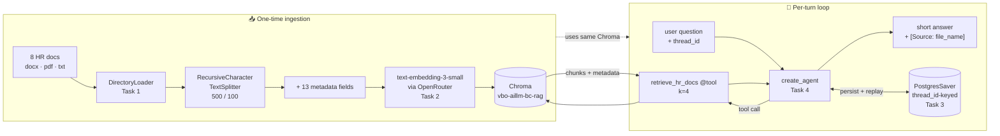
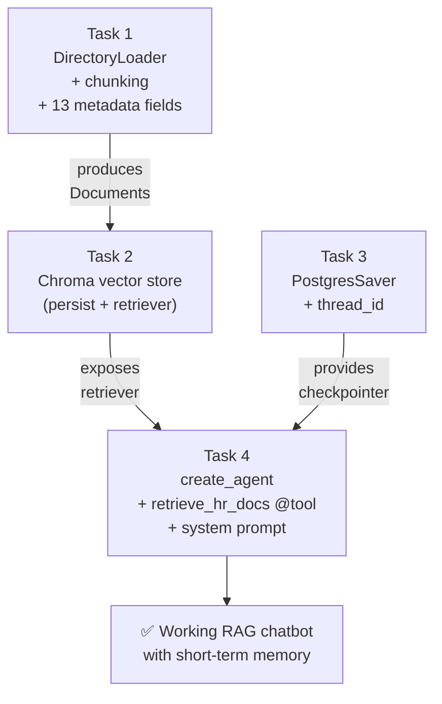

# Week 6 Homework — RAG Chatbot with Short-Term Memory

**Duration:** ~3 hours
**Python:** >= 3.10, `langchain >= 1.2.0`
**LLM / Embeddings:** OpenRouter (Gemini 2.5 Flash Lite + `text-embedding-3-small`)
**Vector store:** Chroma (persistent)
**Memory backend:** Postgres via `PostgresSaver`
**Rule:** Do **not** commit your API key. Use `.env` only.

---

## What you already know (from previous weeks)

- **[Week 3 — Embeddings](../week3-embedding/README.md)**: how text becomes a dense vector and why cosine similarity finds "meaning-near" passages.
- **[Week 4 — Vectorization & Chunking](../week4-vectorization/README.md)**: how to split a long document into retrievable chunks and persist them in a vector index.
- **[Week 5 — Structured Output Agent](../week5-structured-output/README.md)**: how to wrap an LLM call in a LangGraph/LangChain agent and validate its output.

This week ties those three threads together into a single application: **load documents → embed & index → retrieve on demand → answer with citations → remember the conversation across turns**. That is the canonical RAG chatbot pattern, and it is the foundation of every "chat with my docs" product on the market.

---

## 🎯 Objective

Build a RAG (Retrieval-Augmented Generation) chatbot that:

1. **Answers questions about HR documents** (DOCX, PDF, TXT) by retrieving relevant chunks before generating a response.
2. **Remembers the conversation** so follow-up questions like "what about sick leave?" resolve correctly without restating the topic.

## What You Will Build



## How the four tasks connect



> **Why RAG instead of a giant context window?** Even with 1M-token models, dumping every HR document into every prompt is slow, expensive, and noisy — the model gets distracted by irrelevant policy text. RAG keeps the prompt tight (top-k passages only), is cheap to update (re-embed one file when HR edits it), and gives you **provenance**: every answer can cite the exact source document. See [Lewis et al., 2020 — Retrieval-Augmented Generation for Knowledge-Intensive NLP](https://arxiv.org/abs/2005.11401) for the original paper and [LangChain's RAG tutorial](https://python.langchain.com/docs/tutorials/rag/) for the modern implementation pattern.

> **Why short-term memory?** A chatbot without memory is a search engine — every question must be self-contained. Real conversations rely on pronouns and elision ("how many days?", "what about that?"). Short-term memory captures the recent turns so the agent can resolve those references. See [LangGraph — Persistence and Memory](https://langchain-ai.github.io/langgraph/concepts/persistence/).

---

## 📋 Technical Requirements

| Requirement | Why this specific choice? | Reference |
|---|---|---|
| Python ≥ 3.10 | Modern type hints (`list[str]`, `X \| None`) without `from __future__`. | [PEP 604](https://peps.python.org/pep-0604/) |
| `langchain >= 1.2.0` | LangChain 1.x stabilized the agent and tool APIs we use. Pre-1.x guides will not compile. | [LangChain 1.0 release](https://blog.langchain.com/langchain-1-0/) |
| `create_agent` from `langchain.agents` | The non-deprecated way to build a tool-using agent. The old `create_react_agent` from `langgraph.prebuilt` still works but is deprecated. | [`langchain.agents.create_agent`](https://docs.langchain.com/oss/python/langchain/agents) |
| `DirectoryLoader` for ingestion | One loader that walks a folder and dispatches each file to the right per-format loader. Saves you from writing the dispatch yourself. | [`DirectoryLoader`](https://python.langchain.com/api_reference/community/document_loaders/langchain_community.document_loaders.directory.DirectoryLoader.html) |
| Chroma with `persist_directory="./chroma_db"` | Persistent on-disk vector store with no separate server to run. Reload across processes by pointing at the same directory. | [Chroma + LangChain](https://python.langchain.com/docs/integrations/vectorstores/chroma/) |
| Collection name `vbo-aillm-bc-rag` | Course convention so the grader's script can connect to the same collection on your machine. | — |
| OpenRouter for chat **and** embeddings | One API key, OpenAI-compatible endpoints, lets you swap models without changing code. | [OpenRouter docs](https://openrouter.ai/docs) |
| Chat: `init_chat_model("openai:google/gemini-2.5-flash-lite", base_url=...)` | Cheap, fast, good enough for HR Q&A. The `openai:` prefix tells `init_chat_model` to use the OpenAI client (OpenRouter speaks OpenAI). | [`init_chat_model`](https://python.langchain.com/api_reference/langchain/chat_models/langchain.chat_models.base.init_chat_model.html) |
| Embeddings: `OpenAIEmbeddings(model="openai/text-embedding-3-small", openai_api_base=...)` | 1536-dim, $0.02 / 1M tokens — the standard small embedding for cost-sensitive RAG. | [OpenAI embeddings overview](https://platform.openai.com/docs/guides/embeddings) |
| `PostgresSaver` checkpointer | Conversation state survives process restart and works across multiple chatbot replicas. The in-memory saver loses everything when you Ctrl-C. | [LangGraph Postgres checkpointer](https://langchain-ai.github.io/langgraph/reference/checkpoints/#langgraph.checkpoint.postgres.PostgresSaver) |

---

## 📁 Expected Structure

```
hr_rag_chatbot/
├── document_loader.py        # Document loading, chunking, metadata
├── vector_store.py           # Chroma create / load / query helpers
├── rag_agent.py              # Agent + retriever tool + Postgres checkpointer
├── main.py                   # CLI: ingest / chat / test
├── requirements.txt
├── .env.example
├── README.md
└── hr_documents_pack/
    └── initial_docs/         # Original HR documents (8 files: docx/pdf/txt)
```

---

## 📝 Tasks

### Task 1 — Document Loading (20 points)

**Deliverable:** `document_loader.py` with one function `load_and_chunk(docs_dir) -> list[Document]`.

Steps:
- Use [`DirectoryLoader`](https://python.langchain.com/api_reference/community/document_loaders/langchain_community.document_loaders.directory.DirectoryLoader.html) with `glob="**/*"` to walk every file under `hr_documents_pack/initial_docs/`. Dispatch on extension to `Docx2txtLoader`, `PyPDFLoader`, and `TextLoader`.
- Chunk with [`RecursiveCharacterTextSplitter`](https://python.langchain.com/api_reference/text_splitters/character/langchain_text_splitters.character.RecursiveCharacterTextSplitter.html) using `chunk_size=500`, `chunk_overlap=100`.
- Attach the **13 metadata fields** below to every chunk's `Document.metadata` dict.

> **Why 500 / 100?** Smaller chunks = sharper retrieval (less noise per hit) but more chunks to embed. 500 chars (~80–100 tokens) is the sweet spot for short policy paragraphs. The 100-char overlap keeps a sentence that straddles a boundary recoverable in *both* neighboring chunks. See [Pinecone — Chunking Strategies](https://www.pinecone.io/learn/chunking-strategies/) and the [LangChain text-splitter explainer](https://python.langchain.com/docs/concepts/text_splitters/).

> **Why metadata at all?** Embeddings answer *"what is this chunk about?"* but metadata answers *"where did it come from, how old is it, which page?"* — the things you need for citations, freshness checks, and filtered retrieval (e.g. "only the leave policy" by `file_name`). Without it, your bot can find the right text but cannot prove where it came from.

#### Required Metadata (13 fields)

| Field | Description | Why we track it |
|---|---|---|
| `file_name` | Original filename | Lets the agent cite a source the user can find. |
| `file_extension` | `.docx`, `.pdf`, `.txt` | Debugging + per-format quality analysis. |
| `file_size_bytes` | File size | Sanity check during ingestion. |
| `character_count` | Total chars in the document | Compare doc-level vs chunk-level for chunking diagnostics. |
| `chunk_index` | Position of this chunk in the doc | Lets you reconstruct the order of retrieved chunks. |
| `chunk_size` | Chars in this chunk | Verifies the splitter actually respected `chunk_size`. |
| `chunk_overlap` | Overlap setting used | Reproducibility — re-running with different overlap is a different index. |
| `document_type` | `document` / `pdf` / `text` | Coarse format category for filtered retrieval. |
| `creation_date` | File ctime | Freshness signal. |
| `last_modified` | File mtime | "Is the doc I retrieved still the latest version?" |
| `ingestion_timestamp` | When it was indexed | Lets you wipe everything ingested before X. |
| `page_number` | PDF page (or `None`) | Citation drill-down ("see p. 4 of it_security.pdf"). |
| `section_title` | Heading if available | Citation precision + future filtered retrieval. |

---

### Task 2 — Vector Store (20 points)

**Deliverable:** `vector_store.py` with two functions: `create_vector_store(documents)` (ingestion) and `load_vector_store()` (query-time loader).

Steps:
- Build embeddings: `OpenAIEmbeddings(model="openai/text-embedding-3-small", openai_api_base="https://openrouter.ai/api/v1", openai_api_key=OPENROUTER_API_KEY)`.
- Ingest with [`Chroma.from_documents(documents, embeddings, collection_name="vbo-aillm-bc-rag", persist_directory="./chroma_db")`](https://python.langchain.com/docs/integrations/vectorstores/chroma/).
- For querying: instantiate `Chroma(collection_name=..., persist_directory=..., embedding_function=embeddings)` and expose a retriever via `vectorstore.as_retriever(search_kwargs={"k": 4})`.
- If you hit `RuntimeError: Your system has an unsupported version of sqlite3`, add this shim at the **top** of `vector_store.py`:
  ```python
  __import__("pysqlite3")
  import sys
  sys.modules["sqlite3"] = sys.modules.pop("pysqlite3")
  ```

> **Why `k=4`?** Pulling more passages does not always help — it dilutes the signal and burns context. 3–5 is the standard starting point for short-document QA; tune it once you see real failure modes. See [LangChain — Retrievers](https://python.langchain.com/docs/concepts/retrievers/).

> **Why a persistent store?** Re-embedding on every chat would cost real money and seconds of latency. Embeddings are deterministic; persist them once, reuse forever (until the doc changes).

---

### Task 3 — Short-Term Memory (25 points)

**Deliverable:** Memory wired into `rag_agent.py` so multi-turn conversations work.

Steps:
- Use [`PostgresSaver.from_conn_string(DB_URI)`](https://langchain-ai.github.io/langgraph/reference/checkpoints/#langgraph.checkpoint.postgres.PostgresSaver) as a context manager.
- Call `checkpointer.setup()` **once** on first run (creates the checkpoint tables; idempotent afterwards).
- Pass `checkpointer=checkpointer` to `create_agent`.
- Pick a stable `thread_id` per user session and pass it as `config={"configurable": {"thread_id": session_id}}` on every `invoke`. Same `thread_id` = same conversation memory.

> **Why `thread_id`?** A checkpointer is keyed by thread. Two users using the same app must NOT share memory. Two turns of the same user MUST share memory. The `thread_id` is the dial that makes that distinction. See [LangGraph — Threads](https://langchain-ai.github.io/langgraph/concepts/persistence/#threads).

> **Why Postgres and not in-memory?** `MemorySaver` is fine for a notebook demo but loses everything on process exit. Postgres survives restart, scales across replicas, and is the only realistic choice for production. See the [Postgres checkpointer how-to](https://langchain-ai.github.io/langgraph/how-tos/persistence_postgres/).

> **Acceptance test:** the agent must understand cross-turn references like *"What about sick leave?"*, *"How many of those?"*, *"Is that policy still active?"* — without the previous turn restated.

---

### Task 4 — RAG Agent (35 points)

**Deliverable:** `rag_agent.py` exposing a `build_agent(checkpointer)` function and a thin `chat(agent, query, thread_id)` helper.

Steps:
- Build a retriever from the persisted vector store: `retriever = vectorstore.as_retriever(search_kwargs={"k": 4})`.
- Define a **`@tool`-decorated** retriever function that calls `retriever.invoke(query)` and returns the chunk text + `file_name` metadata. The agent decides when to call it.
- Build the model: `init_chat_model("openai:google/gemini-2.5-flash-lite", api_key=..., base_url="https://openrouter.ai/api/v1", temperature=0)`.
- Wire it all together: `create_agent(model=model, tools=[retrieve_hr_docs], checkpointer=checkpointer, prompt=SYSTEM_PROMPT)`.
- **System prompt rules**: answer in **2–3 sentences**, **always cite the `file_name`** of the source chunk, say *"I don't know — this isn't in the HR docs"* if retrieval comes back empty.

> **Why a tool-using agent and not a plain `RetrievalQA` chain?** Two reasons: (1) the agent can decide *not* to retrieve when a follow-up like "thanks" or "what was that file called?" doesn't need fresh retrieval; (2) you can later add more tools (calculator, calendar, ticket-creation) without rewriting the chain. See [LangChain agents conceptual guide](https://python.langchain.com/docs/concepts/agents/).

> **Why short answers?** HR users want the answer, not a wall of text. Long answers also leak more retrieved content into the prompt window of the next turn, which slows things down. Answer length is a UX choice — pick it deliberately.

> **Why citations?** Compliance. If an HR bot says "you get 25 vacation days" the user must be able to verify that against the actual policy doc. No citation = no trust. See [Anthropic — citations in RAG](https://www.anthropic.com/news/contextual-retrieval) for why provenance matters.

---

## 🧪 Testing

### Required Test Questions

Run these as a smoke test (`python main.py test`) and verify each answer cites a real `file_name`:

1. "What is the company's leave policy?"
2. "How many vacation days do employees get?"
3. "What are the steps in the offboarding process?"
4. "What are the IT security requirements for new employees?"
5. "What is the performance review process?"
6. "How do I submit travel expenses for reimbursement?"

### Short-Term Memory Test

```
You: What is the leave policy?
Bot: Employees get 20 vacation days per year, plus public holidays.
     [Source: leave_policy.docx]

You: What about sick leave?
Bot: Sick leave is 10 paid days per year and requires a doctor's note after 2 days.
     [Source: leave_policy.docx]
```

The second turn does **not** repeat "leave policy" — the agent must resolve "sick leave" against the prior turn's topic via the checkpointer.

---

## 📊 Grading

| Task | Points | Pass criteria |
|---|---|---|
| Document Loading (13 metadata fields) | 20 | All 8 docs loaded, every chunk has all 13 metadata fields populated. |
| Vector Store | 20 | Persists to `./chroma_db`, collection name exact, `k=4` retriever works after restart. |
| Short-Term Memory | 25 | Postgres-backed, `thread_id`-scoped, follow-up references resolve correctly. |
| RAG Agent | 35 | Tool-using `create_agent`, ≤3-sentence answers, every answer cites `file_name`. |
| **Total** | **100** | |

---

## 🚫 Common Pitfalls

| Pitfall | Symptom | Fix |
|---|---|---|
| Forgetting to call `checkpointer.setup()` | `relation "checkpoints" does not exist` | Run `setup()` once; it's idempotent. |
| Using two different `thread_id`s in the same session | Bot acts amnesiac on every turn | Generate the id once per session, reuse it. |
| Ingesting twice into the same collection | Duplicate chunks → biased retrieval | Either delete `./chroma_db/` before re-ingest, or check `vectorstore._collection.count()` first. |
| Mixing OpenAI vs OpenRouter base URLs | `401 Unauthorized` | OpenRouter URL **and** key together — never one without the other. |
| Using deprecated `create_react_agent` | DeprecationWarning + future breakage | Use `langchain.agents.create_agent`. |
| SQLite version error on Linux | `unsupported version of sqlite3` at Chroma import | Add the `pysqlite3` shim at the top of `vector_store.py`. |

---

## 📚 Further Reading

- [LangChain RAG tutorial (canonical)](https://python.langchain.com/docs/tutorials/rag/)
- [LangChain agents — `create_agent`](https://docs.langchain.com/oss/python/langchain/agents)
- [LangGraph persistence & checkpointers](https://langchain-ai.github.io/langgraph/concepts/persistence/)
- [Chroma docs](https://docs.trychroma.com/)
- [Pinecone — Chunking Strategies for RAG](https://www.pinecone.io/learn/chunking-strategies/)
- [Lewis et al., 2020 — RAG paper](https://arxiv.org/abs/2005.11401)
- [Anthropic — Contextual Retrieval](https://www.anthropic.com/news/contextual-retrieval)
