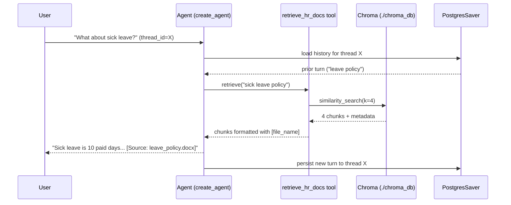
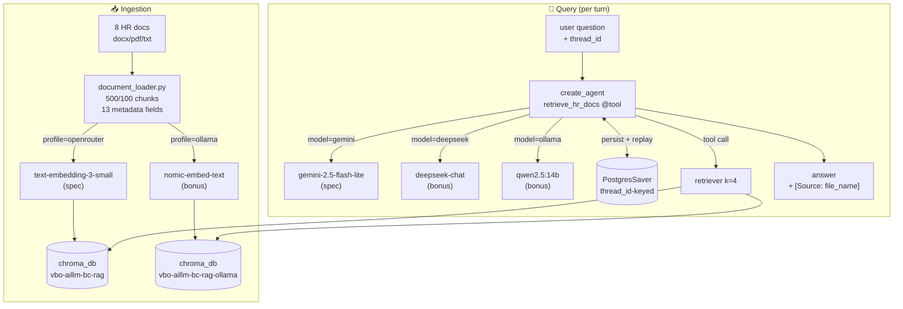

# Week 6 — HR RAG Chatbot with Short-Term Memory

A retrieval-augmented chatbot that answers HR-policy questions over 8 source documents (DOCX / PDF / TXT) and remembers the conversation across turns using a Postgres-backed LangGraph checkpointer.

📚 **Related docs:**
- [`../homework.md`](../homework.md) — full assignment brief with rationale + links
- [`../learning.md`](../learning.md) — concepts taught + reference reading
- [`../model_comparison.md`](../model_comparison.md) — 3-way Gemini / DeepSeek / Ollama benchmark
- [`../extras.md`](../extras.md) — what was added beyond spec + roadmap (reranker, RAGAS, GraphRAG)

## Pipeline Overview

```mermaid
flowchart LR
    A["hr_documents_pack/initial_docs/<br/>(8 files: docx, pdf, txt)"] -->|DirectoryLoader| B["document_loader.py<br/>RecursiveCharacterTextSplitter<br/>500/100 chunks + 13 metadata fields"]
    B -->|Chroma.from_documents| C["chroma_db/<br/>collection: vbo-aillm-bc-rag"]
    D["User query"] -->|invoke| E["create_agent<br/>(Gemini 2.5 Flash Lite)"]
    E -->|@tool retrieve_hr_docs| F["retriever<br/>k=4"]
    F -->|cosine top-k| C
    F -->|chunks + file_name| E
    E -->|answer + [Source: ...]| G["User"]
    E <-->|thread_id| H["PostgresSaver<br/>checkpointer"]
```

## Per-turn flow



## Setup

### 1. Python env

```bash
cd hr_rag_chatbot
python -m venv .venv && source .venv/bin/activate
pip install -r requirements.txt
```

### 2. API keys

```bash
cp .env.example .env
# fill in OPENROUTER_API_KEY and DB_URI
```

### 3. Postgres for memory

Quickest local option:

```bash
docker run -d --name hr-rag-pg -p 5432:5432 \
    -e POSTGRES_PASSWORD=postgres -e POSTGRES_DB=hr_rag postgres:16
```

Then keep the default `DB_URI` in `.env`.

## Run

```bash
# 1. Ingest the HR docs (default: OpenRouter embeddings — spec)
python main.py ingest                            # = --profile openrouter
python main.py ingest --profile ollama           # bonus: local nomic-embed-text

# 2. Interactive chat (short-term memory enabled)
python main.py chat                              # default --model gemini (spec)
python main.py chat --model deepseek             # bonus: DeepSeek chat
python main.py chat --model ollama               # bonus: full-local stack

# 3. Smoke + memory test → results/test_<model>.jsonl
python main.py test --model gemini
python main.py test --model deepseek
python main.py test --model ollama

# 4. Score all results side-by-side
python scorer.py
```

See [`../model_comparison.md`](../model_comparison.md) for the full 3-model writeup.

## Project Structure

```
week6-rag/
├── homework.md               # Assignment brief (with rationale + links)
├── learning.md               # Concepts taught + reading list
├── model_comparison.md       # 3-way Gemini/DeepSeek/Ollama writeup
├── extras.md                 # Beyond-spec additions + roadmap
└── hr_rag_chatbot/
    ├── document_loader.py    # File walk + 500/100 splitter + 13 metadata fields
    ├── vector_store.py       # Chroma + dual embedding profiles (OpenRouter / Ollama)
    ├── rag_agent.py          # create_agent + @tool retrieval + PostgresSaver + 3 model profiles
    ├── main.py               # CLI: ingest / chat / test  (--model + --profile flags)
    ├── scorer.py             # Side-by-side metrics across results/*.jsonl
    ├── results/              # test_gemini.jsonl, test_deepseek.jsonl, test_ollama.jsonl
    ├── chroma_db/            # Persisted vectors (gitignored)
    ├── requirements.txt
    ├── .env.example
    └── hr_documents_pack/
        └── initial_docs/     # 8 source docs
```

## Architecture (with all profiles)



## Key choices

| Choice | Why |
|---|---|
| **Chroma persistent on disk** | No separate server. Reload by pointing at the same `persist_directory`. |
| **`text-embedding-3-small` via OpenRouter** | $0.02 / 1M tokens, 1536-dim, OpenAI-compatible. One API key for embeddings + chat. |
| **`k=4` retrieval** | Sweet spot for short-doc QA. More context → more noise + more tokens. |
| **`create_agent` (LangChain 1.x)** | The non-deprecated path. Old `create_react_agent` from `langgraph.prebuilt` still works but is on the way out. |
| **`PostgresSaver` instead of `MemorySaver`** | Memory survives process restart and scales across replicas. The in-memory saver is a notebook-only toy. |
| **`thread_id` per session** | Two users must not share memory. Two turns of one user must. The `thread_id` is the dial that makes that happen. |

## Required metadata (13 fields)

| Field | Source |
|---|---|
| `file_name`, `file_extension`, `file_size_bytes`, `creation_date`, `last_modified` | `Path.stat()` |
| `document_type` | extension → `document` / `pdf` / `text` |
| `character_count` | total chars in the parent doc |
| `chunk_index`, `chunk_size`, `chunk_overlap` | from `RecursiveCharacterTextSplitter` config + position |
| `ingestion_timestamp` | `datetime.now(UTC)` at ingest time |
| `page_number` | from `PyPDFLoader` (PDFs only, else `""`) |
| `section_title` | from loader metadata if present, else `""` |

> Chroma rejects `None` metadata values, so missing optional fields are coerced to `""` to keep all 13 keys present on every chunk.
