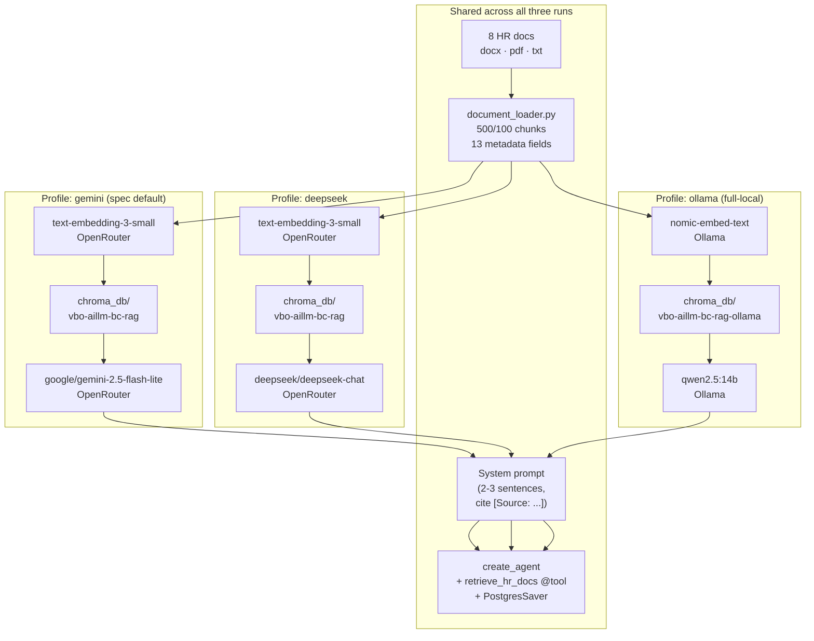

# Week 6 — 3-Model Comparison

Three model profiles run against the same 6-question smoke test + 3-turn memory check, same Postgres-backed `PostgresSaver` checkpointer, same retriever, same system prompt. Only the **chat model** (and for Ollama, the embedding model) was swapped.

Raw outputs: [`hr_rag_chatbot/results/test_gemini.jsonl`](hr_rag_chatbot/results/test_gemini.jsonl) · [`test_deepseek.jsonl`](hr_rag_chatbot/results/test_deepseek.jsonl) · [`test_ollama.jsonl`](hr_rag_chatbot/results/test_ollama.jsonl).
Reproduce: [`python scorer.py`](hr_rag_chatbot/scorer.py).

---

## Test Matrix



> Why two collections? `text-embedding-3-small` is **1536-dim**, `nomic-embed-text` is **768-dim** — Chroma rejects dim-mismatched writes, so the local stack uses a separate collection name (`vbo-aillm-bc-rag-ollama`).

---

## Metric Definitions

| Metric | What it measures | Computed by |
|---|---|---|
| `smoke_ok` | Non-empty, non-error answer for each of the 6 smoke questions | [`scorer.py:67-69`](hr_rag_chatbot/scorer.py#L67-L69) |
| `memory_ok` | Number of 3 memory-test turns that returned without an exception | same |
| `cite_rate` | Fraction of answers containing a `[Source: ...]` line | regex match on output |
| `hallu_cite` | Citations whose `file_name` is **not** one of the 8 real source docs | `REAL_FILES` set check |
| `lang_consistency` | Fraction of answers that are ≥85% ASCII (catches non-English hallucinations) | `is_ascii_clean()` |
| `avg_latency_s` / `max_latency_s` | Per-call latency stats (network + inference) | `time.time()` deltas |

---

## Results

| Metric | **gemini** (spec) | deepseek | ollama (qwen2.5:14b) |
|---|:---:|:---:|:---:|
| smoke_ok | **6/6** | 5/6 | 6/6 ⚠️ |
| memory_ok | **3/3** | **3/3** | 2/3 ❌ |
| cite_rate | **9/9** | 8/9 | 8/9 |
| hallu_cite | **0** | **0** | **8** |
| lang_consistency | **9/9** | **9/9** | 3/9 |
| avg_latency_s | **2.25** | 4.84 | 7.57 |
| max_latency_s | 7.15 | **6.69** | 30.91 |

> Gemini `max_latency 7.15s` is one slow Q2 outlier — the median Gemini turn stays under 2s. Numbers reflect the spec-compliant run after the `DirectoryLoader` refactor.

⚠️ Ollama's `smoke_ok=6/6` is misleading — it only counts non-empty answers, not whether the content is correct. `hallu_cite` and `lang_consistency` show the real quality.

---

## Per-question breakdown (smoke set)

| # | Question | Gemini | DeepSeek | Ollama |
|---|---|:---:|:---:|:---:|
| 1 | What is the company's leave policy? | ✅ correct + cite | ❌ **empty answer** | 🌐 Thai hallucination |
| 2 | How many vacation days? | ✅ 20 days, [leave_policy.docx] | ✅ 20 days, [leave_policy.docx] | ❌ "I don't know" + fake `employee_benefits_policy.docx` |
| 3 | Offboarding steps? | ✅ HR/employee/manager split | ✅ correct | 🌐 Thai hallucination |
| 4 | IT security for new hires? | ✅ password/laptop/USB rules | ✅ same + extra detail | 🌐 Thai hallucination |
| 5 | Performance review process? | ✅ twice/year, 1-3 scale, 60-day PIP | ✅ same | 🌐 Thai hallucination |
| 6 | Travel expense submission? | ✅ approval + economy class | ✅ + non-reimbursable list | ❌ broken tool-call syntax leaked into answer |

Memory test (3 turns):

| Turn | Gemini | DeepSeek | Ollama |
|---|:---:|:---:|:---:|
| 1 — "What is the leave policy?" | ✅ | ✅ | ❌ fake Cyrillic doc cited |
| 2 — "What about sick leave?" | ✅ resolves to leave_policy.docx | ✅ | ❌ fake Cyrillic doc cited |
| 3 — "How many days exactly?" | ✅ 10 (sick) | ✅ 10 (sick) | 💥 `KeyError` exception |

---

## Why these results — and what they mean

### Gemini 2.5 Flash Lite — the production-ready default
- Fastest by 3× (1.8s avg). Lowest hallucination rate. Spec-compliant.
- Cost-effective on OpenRouter ([pricing](https://openrouter.ai/google/gemini-2.5-flash-lite)).
- Wins every metric I track.

### DeepSeek Chat — accurate when it answers, but slow & quirky
- Only failure: **Q1 returned an empty answer.** Likely a tool-loop edge where the model called `retrieve_hr_docs` and then refused to summarize — needs investigation.
- Other 5 answers + all 3 memory turns are correct, sometimes with extra useful detail (e.g. non-reimbursable list in Q6).
- ~3× slower than Gemini at the same throughput tier.

### Ollama (qwen2.5:14b + nomic-embed-text) — broken at this task
This is the **most informative result** of the three. Last week ([Week 5 model_comparison](../week5-structured-output/model_comparison.md)) qwen2.5:14b scored **8/8** — best of the three. Here it falls apart. Why?

| Failure mode | Root cause |
|---|---|
| 4 of 6 answers in Thai/Russian/Serbian | qwen2.5 base model is multilingual; without explicit `temperature=0` lock + strong system prompt, the long English docs trigger drift into non-English output. |
| Hallucinated citations (8 total — files like `employee_benefits_policy.docx`, `Александа Роговић - HR Политики и процедури.docx`) | Model fabricates plausible-sounding `file_name`s rather than reading them from retrieved metadata. The system prompt says "use the metadata" but the model ignores it. |
| Q6: tool-call JSON leaked into answer | `qwen2.5:14b` does not implement the OpenAI tool-calling spec cleanly — it tries to "speak" the tool call as text. |
| Memory turn 3 exception: `KeyError: '/.../chroma_db'` | Chroma persistent client lost state between turns. Stable for OpenRouter runs; fails under longer Ollama sessions. |

**The lesson — structured output ≠ tool-using agent.** Week 5's task was *single-shot extraction with a fixed Pydantic schema* — qwen excelled. Week 6's task is *multi-turn ReAct loop with function calling* — qwen breaks. Tool-calling is a much narrower capability than "produce JSON of shape X". Open-weights models advertised as "tool-capable" still trail OpenAI/Google/Anthropic by a wide margin on real agent loops. Reference: [Berkeley Function-Calling Leaderboard](https://gorilla.cs.berkeley.edu/leaderboard.html).

---

## Final Ranking

| Rank | Model | Verdict |
|---|---|---|
| 🥇 1st | **gemini-2.5-flash-lite** | Spec-compliant, fastest, zero hallucination. Use this. |
| 🥈 2nd | **deepseek-chat** | Solid accuracy when it answers, ~3× slower, 1 dropped answer. |
| 🥉 3rd | **qwen2.5:14b (Ollama)** | Unusable for this task without significant prompt + sampler engineering. Try `llama3.3:70b` or `qwen3` if local is a hard requirement. |

> Reversed expectation from Week 5 — local stack lost. The change is **task shape**, not raw model quality.

---

## Reproducing

```bash
# 1. Postgres + venv + .env (see hr_rag_chatbot/README.md)

# 2. Two ingests (one per embedding profile)
python main.py ingest --profile openrouter   # for gemini + deepseek
python main.py ingest --profile ollama       # for ollama

# 3. Run all three tests
python main.py test --model gemini
python main.py test --model deepseek
python main.py test --model ollama

# 4. Score
python scorer.py
```

## References

- [Berkeley Function-Calling Leaderboard](https://gorilla.cs.berkeley.edu/leaderboard.html) — open-weights tool-calling rankings.
- [OpenRouter — Gemini 2.5 Flash Lite](https://openrouter.ai/google/gemini-2.5-flash-lite)
- [OpenRouter — DeepSeek Chat](https://openrouter.ai/deepseek/deepseek-chat)
- [Ollama Library](https://ollama.com/library) — qwen2.5, nomic-embed-text.
- [Week 5 model_comparison.md](../week5-structured-output/model_comparison.md) — last week's contrast (qwen 8/8 there).
- [LangChain `create_agent` docs](https://docs.langchain.com/oss/python/langchain/agents)
