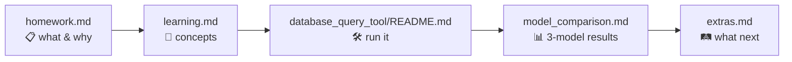
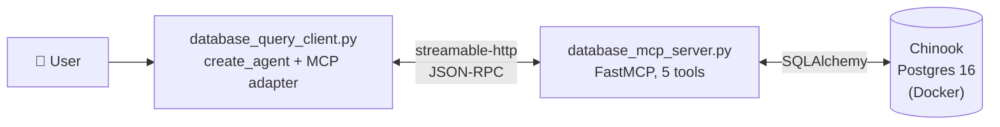

# Week 7 — Database Query Tool, MCP Edition

A natural-language SQL agent for the Chinook sample database, split across an
**MCP server** (FastMCP, five read-only tools, `streamable-http`) and an
**MCP client** (LangChain `create_agent` consuming the remote tools through
`langchain-mcp-adapters`). Postgres + Chinook run in Docker.

## Documents in this folder

| File | Purpose |
|---|---|
| [`homework.md`](homework.md) | Assignment brief — four tasks, mermaid diagrams, reference links per task |
| [`learning.md`](learning.md) | Concepts taught + reading list (MCP spec, FastMCP, defense in depth) |
| [`model_comparison.md`](model_comparison.md) | 3-model benchmark (`qwen2.5:14b` / `qwen3:14b` / `qwen3-coder:30b`) + Claude Opus 4.7 LLM-as-judge scoring |
| [`extras.md`](extras.md) | Beyond-spec roadmap: 18 follow-up projects across 7 themes — opens with the "critical trio" (read-only role, statement timeout, audit log) |
| [`database_query_tool/`](database_query_tool/) | The actual code — server, client, tests, Docker setup |

## Reading order



## Architecture in one picture



## What changes vs Week 6

| Aspect | Week 6 (RAG) | Week 7 (MCP) |
|---|---|---|
| Tool location | Same Python process as the agent | Separate process, reachable over HTTP |
| Tool definition | `@tool` Python decorator | `@mcp.tool()` + JSON-RPC schema |
| Discoverability | Hard-coded in `tools=[...]` | `await client.get_tools()` at runtime |
| Reusable by other clients | No — LangChain only | Yes — Claude Desktop, Cursor, anything MCP-aware |
| Trust boundary | Implicit (same process) | Explicit (validate every input) |

> **Port note for graders.** The rubric assumes Postgres on `5432`. This
> stack uses **host `5433` → container `5432`** because Week 6's
> `hr-rag-pg` already binds 5432 on the same machine. In-container
> behavior is identical; only the host-side port differs. Full
> explanation in [`database_query_tool/README.md`](database_query_tool/README.md#port-mapping--note-for-graders).

## Quick start

```bash
cd database_query_tool
python -m venv .venv && source .venv/bin/activate
pip install -r requirements.txt
cp .env.example .env  # add OPENROUTER_API_KEY

./setup_db.sh                       # database (Docker)
python database_mcp_server.py       # terminal A
python test_mcp_server.py           # terminal B — 10 smoke checks
python database_query_client.py     # terminal B — chat with the database
```

Full instructions: [`database_query_tool/README.md`](database_query_tool/README.md).
