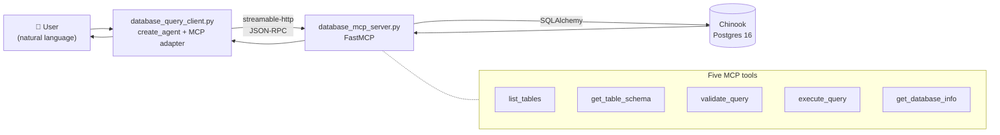

# Database Query Tool — MCP Edition

A natural-language interface to the Chinook sample database, split into two
processes: an **MCP server** that exposes five read-only database tools, and an
**LLM client** that asks the server for tools and uses them to answer
questions.

## Architecture at a glance



## Files

| File | Purpose |
|---|---|
| [`database_mcp_server.py`](database_mcp_server.py) | FastMCP server — five read-only tools over `streamable-http` |
| [`database_query_client.py`](database_query_client.py) | Interactive LangChain agent that uses the remote tools |
| [`test_mcp_server.py`](test_mcp_server.py) | Ten-step smoke test against a running server |
| [`docker-compose.yml`](docker-compose.yml) | Postgres 16 + Chinook — **host `5433` → container `5432`** (see "Port mapping" note below) |
| [`setup_db.sh`](setup_db.sh) | Downloads the Chinook SQL and starts the container |
| [`requirements.txt`](requirements.txt) | Python dependencies |
| [`.env.example`](.env.example) | Copy to `.env` and fill in your OpenRouter key |

## Port mapping — note for graders

The homework rubric assumes Postgres listens on **5432**, but Week 6
(`hr-rag-pg`) already binds that port on the same machine. To let both
projects coexist, this stack maps **host `5433` → container `5432`**:

```yaml
# docker-compose.yml
ports:
  - "5433:5432"   # host:container
```

The Chinook container still runs Postgres on its internal `5432`. All
in-container behavior is identical to the rubric. The only externally
visible difference is the host-side port, which is documented in
`.env.example` (`DATABASE_URL=...localhost:5433/chinook`).

If you need to match the rubric literally, stop Week 6 first
(`docker stop hr-rag-pg`) and change the compose line to `"5432:5432"`.

---

## Quick start

```bash
# 0. one-time install
python -m venv .venv && source .venv/bin/activate
pip install -r requirements.txt
cp .env.example .env  # then edit and add OPENROUTER_API_KEY

# 1. database (Docker)
./setup_db.sh
# this downloads Chinook_PostgreSql.sql and runs `docker compose up -d`

# 2. MCP server (terminal A)
python database_mcp_server.py
# → [mcp] starting on http://0.0.0.0:8000/mcp

# 3. tests or client (terminal B)
python test_mcp_server.py        # 10 smoke checks
python database_query_client.py  # chat with the database
```

## Sample chat session

> Chinook v1.4.5 (the version `setup_db.sh` downloads) uses **lowercase
> snake_case** identifiers: `album`, `track`, `invoice_line`, `album_id`, …

```
you> Which artist sells the most tracks?
bot> Iron Maiden sells the most tracks.

    SELECT ar.name, COUNT(il.invoice_line_id) AS sold
    FROM artist ar
    JOIN album al ON al.artist_id = ar.artist_id
    JOIN track t  ON t.album_id  = al.album_id
    JOIN invoice_line il ON il.track_id = t.track_id
    GROUP BY ar.name
    ORDER BY sold DESC
    LIMIT 1;
```

## The five tools

| Tool | Returns | Safety |
|---|---|---|
| `list_tables` | comma-separated table names | read-only |
| `get_table_schema(table_names)` | `CREATE TABLE …` blocks for one or more tables | read-only |
| `validate_query(query)` | `OK …` or `REJECTED — <reason>` | static check, no execution |
| `execute_query(query, limit=100)` | JSON `{row_count, rows}` | rejects anything that is not a single SELECT/WITH |
| `get_database_info()` | engine, driver, sanitized URL, table count | read-only |

## Safety design

Defense in depth. Each layer is independent.

1. **Application allow-list.** `validate_query` and `execute_query` parse the
   statement, strip comments, refuse multiple statements, and reject any
   token outside SELECT / WITH. See `_is_select_only` in
   [`database_mcp_server.py`](database_mcp_server.py).
2. **Hard row cap.** `execute_query` clamps `limit` to `MCP_MAX_LIMIT` (default
   1000) so a careless `SELECT *` cannot drag the server down.
3. **Database-level read-only role (recommended).** Create a Postgres role with
   `GRANT SELECT` only and point `DATABASE_URL` at it. The application check
   plus a least-privileged role together stop both bugs and abuse.

## Common pitfalls

| Symptom | Cause | Fix |
|---|---|---|
| `connection refused` on 5433 | container not up | `docker compose ps`; rerun `./setup_db.sh` |
| `port is already allocated` (5432 or 5433) | another Postgres is bound to that port | edit `docker-compose.yml` ports and `.env` `DATABASE_URL` together |
| `relation "Album" does not exist` | wrong case — Chinook v1.4.5 is lowercase | use `album`, `track`, `invoice_line` (snake_case, unquoted) |
| `cannot drop the currently open database` during init | `POSTGRES_DB=chinook` makes init connect to the DB the script tries to drop | leave `POSTGRES_DB=postgres` (already set in `docker-compose.yml`) |
| Client sees zero tools | server crashed silently | check terminal A; `pgrep -f database_mcp_server.py` |
| `OPENROUTER_API_KEY is not set` | `.env` not loaded | run from this directory and confirm `.env` exists |
