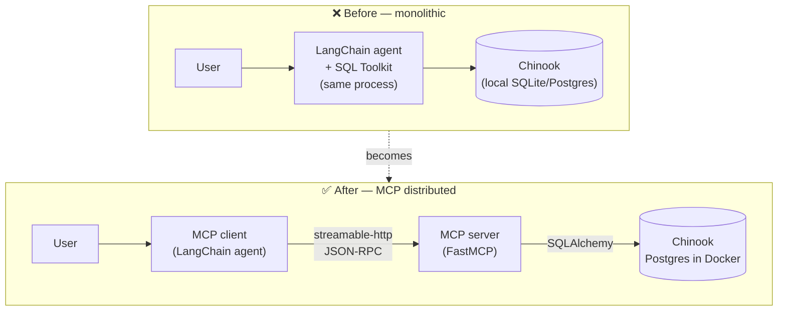
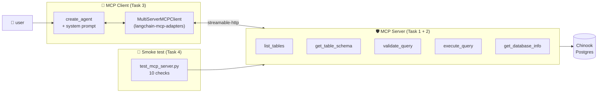
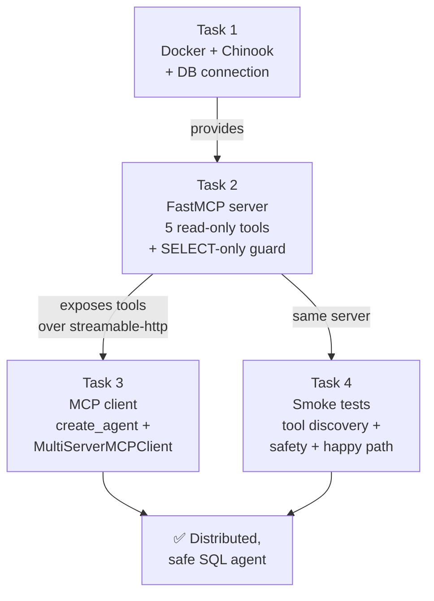

# Week 7 Homework — From Monolithic SQL Agent to MCP Architecture

**Duration:** ~3 hours
**Python:** >= 3.10
**LLM:** OpenRouter (Gemini 2.5 Flash Lite)
**Database:** PostgreSQL 16 + Chinook sample DB (Docker)
**Transport:** MCP `streamable-http`
**Rule:** Do **not** commit your API key. Use `.env` only.

---

## What you already know (from previous weeks)

- **[Week 5 — Structured-output agent](../week5-structured-output/README.md)**: how `create_agent` wraps an LLM in a tool-using loop, and why Pydantic schemas matter at the boundary.
- **[Week 6 — RAG chatbot](../week6-rag/README.md)**: how to expose a custom retrieval function as a `@tool` that the agent can call when it decides to.

This week we **invert the direction**. Until now, tools lived in the same Python process as the agent. This week we pull them out, put them behind an HTTP server, and have the agent discover them at runtime over the **Model Context Protocol**.

---

## 🎯 Objective

Convert the existing database query tool from a **monolithic** LangChain
application (agent + SQL toolkit + database in one process) into a
**distributed** MCP architecture (agent ↔ MCP server ↔ database, three
processes that communicate over HTTP).



> **Why bother?** A monolithic agent works for a demo. The moment a *second* agent (Claude Desktop, Cursor, your colleague's LangGraph job) needs the same database tools, you either copy/paste the toolkit or you put the tools behind a protocol everyone speaks. That protocol is **MCP**. See the [Anthropic MCP launch post](https://www.anthropic.com/news/model-context-protocol) and the [official MCP spec](https://modelcontextprotocol.io/specification/2025-03-26).

---

## What You Will Build



## How the four tasks connect



---

## 📋 Technical Requirements

| Requirement | Why this specific choice? | Reference |
|---|---|---|
| Python ≥ 3.10 | Modern type hints (`list[str]`, `X \| None`) without `from __future__`. | [PEP 604](https://peps.python.org/pep-0604/) |
| `mcp >= 1.2` | Brings `FastMCP` (Pythonic decorator API) and the `streamable-http` transport. | [Python MCP SDK](https://github.com/modelcontextprotocol/python-sdk) |
| `streamable-http` (not `stdio`) | `stdio` is a local subprocess pipe — fine for Claude Desktop, useless across machines. `streamable-http` puts the server on the network so any client can reach it. | [MCP transports](https://modelcontextprotocol.io/specification/2025-03-26/basic/transports) |
| `langchain-mcp-adapters` | Auto-converts MCP tool schemas into LangChain `Tool` objects so `create_agent` works unchanged. | [`langchain-mcp-adapters` repo](https://github.com/langchain-ai/langchain-mcp-adapters) |
| PostgreSQL 16 + Chinook | Realistic relational schema (artists / albums / tracks / invoices) — JOINs, FKs, dates. The `lerocha/chinook-database` repo ships a ready-made Postgres script. | [Chinook database](https://github.com/lerocha/chinook-database) |
| SQLAlchemy 2.x | Engine + dialect-aware reflection (`inspect`), and `text()` for safe parameter binding. | [SQLAlchemy 2.0 tutorial](https://docs.sqlalchemy.org/en/20/tutorial/index.html) |
| OpenRouter (Gemini 2.5 Flash Lite) | Same model as Week 6 — cheap, tool-calling-capable, OpenAI-compatible API. | [OpenRouter docs](https://openrouter.ai/docs) |

---

## 📁 Expected Structure

```
database_query_tool/
├── database_mcp_server.py       # FastMCP server, 5 tools
├── database_query_client.py     # Interactive create_agent client
├── test_mcp_server.py           # 10-step smoke test
├── docker-compose.yml           # Postgres + Chinook
├── setup_db.sh                  # Downloads Chinook SQL, starts container
├── requirements.txt
├── .env.example
└── README.md
```

---

## 📝 Tasks

### Task 1 — Database on Docker (15 points)

**Deliverable:** `docker-compose.yml` and `setup_db.sh` that bring up a Postgres
container preloaded with the Chinook schema and data.

Steps:
- Use the [`postgres:16` image](https://hub.docker.com/_/postgres). Mount
  `Chinook_PostgreSql.sql` into `/docker-entrypoint-initdb.d/` so the official
  entrypoint runs it on the first boot of an empty data volume.
- Download the SQL from [`lerocha/chinook-database`](https://github.com/lerocha/chinook-database/blob/master/ChinookDatabase/DataSources/Chinook_PostgreSql.sql).
- Add a healthcheck so `docker compose up -d` only returns when `pg_isready`
  passes.

> **Why a container and not a local install?** The grader runs your code on
> their machine. A container is the only way to guarantee the same Postgres
> version, the same locale, and the same data — without telling them to
> `brew install postgresql`. See [Docker Compose for one-off services](https://docs.docker.com/compose/).

> **Why mount into `docker-entrypoint-initdb.d/`?** That folder is a
> *convention* of the official Postgres image: any `.sql` or `.sh` files
> there are executed once, on the first boot of an empty data volume. No
> custom Dockerfile needed.

---

### Task 2 — MCP Server (40 points)

**Deliverable:** `database_mcp_server.py` exposing exactly five tools over
`streamable-http`.

Steps:
- Create the server: `mcp = FastMCP("chinook-database", host="0.0.0.0", port=8000)`.
- Register five `@mcp.tool()` async functions:

  | Tool | Signature | Behavior |
  |---|---|---|
  | `list_tables` | `() -> str` | Comma-separated, sorted table names. |
  | `get_table_schema` | `(table_names: str) -> str` | Accept comma-separated names; return `CREATE TABLE`-style blocks (columns + types + PK + FKs). |
  | `validate_query` | `(query: str) -> str` | Static check, no execution. Reject multi-statements, DDL, DML. |
  | `execute_query` | `(query: str, limit: int = 100) -> str` | Run a single SELECT/WITH and return `{"row_count", "rows"}` JSON. |
  | `get_database_info` | `() -> str` | Dialect, driver, sanitized URL, table count. |

> **Note on the wire format.** When a remote MCP tool is called via
> `langchain-mcp-adapters`, the result is **not** the raw `str` your function
> returns — it is a list of MCP content blocks
> (`[{"type": "text", "text": "..."}]`). Tests need a small `_text(result)`
> helper to flatten that back to a string. The agent in `create_agent` does
> this for you transparently; the smoke test does not.

- Run with `mcp.run(transport="streamable-http")`.

> **Why FastMCP?** Two reasons. (1) The decorator generates the JSON-RPC tool
> schema from your function signature and docstring — no hand-written
> `inputSchema`. (2) The tool is just a Python function, so unit-testing it
> requires no MCP machinery. See the [MCP server quickstart](https://modelcontextprotocol.io/quickstart/server) and the [FastMCP examples](https://github.com/modelcontextprotocol/python-sdk/tree/main/examples).

> **Why a `validate_query` tool *and* a check inside `execute_query`?** They
> serve different audiences. `validate_query` lets the agent reason ("is this
> safe?") *before* execution and explain rejections to the user.
> `execute_query` re-runs the same check because **never trust the caller** —
> a future client might skip validation. Defense in depth.

> **Why SELECT/WITH only and a comment-stripping pass?** Comments can hide
> `; DROP TABLE` from a naïve keyword scan. We strip `--` and `/* ... */`
> first, then check that the remaining statement starts with `SELECT` or
> `WITH`, contains no `;` (no piggyback statements), and contains no DDL/DML
> keywords. The classic OWASP write-up on [SQL injection](https://owasp.org/www-community/attacks/SQL_Injection)
> is short and worth re-reading every year.

---

### Task 3 — MCP Client (35 points)

**Deliverable:** `database_query_client.py` — an interactive REPL where the
user types a question in natural language and the agent answers using the
remote tools.

Steps:
- Build the client: `MultiServerMCPClient({"database": {"transport": "streamable_http", "url": "http://localhost:8000/mcp"}})`.
- Discover tools: `tools = await client.get_tools()`.
- Build the model: `init_chat_model("openai:google/gemini-2.5-flash-lite", api_key=..., base_url="https://openrouter.ai/api/v1", temperature=0)`.
- Wire it up: `create_agent(model=model, tools=tools, prompt=SYSTEM_PROMPT, checkpointer=MemorySaver())`.
- System prompt rules: SELECT-only, always include the SQL in a fenced code
  block, refuse writes politely, never invent rows.

> **Why `langchain-mcp-adapters` instead of writing the JSON-RPC ourselves?**
> The adapter exposes each MCP tool as a normal LangChain `Tool` object —
> `create_agent` cannot tell the difference between a local `@tool` and a
> remote MCP tool. That means **zero code change in the agent** to add a new
> remote tool: stand up an MCP server, point the client at it, you are done.
> See the [adapter README](https://github.com/langchain-ai/langchain-mcp-adapters).

> **Why a system prompt that *re-states* the rules already enforced by the
> server?** The server enforces with code (hard wall). The prompt enforces
> with words (soft fence). Both are needed: the prompt makes the agent
> *prefer* safe queries, so the user gets a clean answer instead of an "Error:
> rejected" loop.

---

### Task 4 — Smoke Tests (10 points)

**Deliverable:** `test_mcp_server.py` — a one-shot script that connects to a
running server, exercises every tool, and prints PASS/FAIL.

The script must check:
1. All five tools are advertised by the server.
2. `get_database_info` returns a `dialect:` line.
3. `list_tables` includes `album` (sanity check that Chinook actually loaded).
4. `get_table_schema(album)` starts with `CREATE TABLE`.
5. `validate_query("SELECT 1")` returns `OK …`.
6. `validate_query("DROP TABLE album")` returns `REJECTED …`.
7. `validate_query("SELECT 1; SELECT 2")` returns `REJECTED …` (multi-statement).
8. `execute_query("SELECT title FROM album LIMIT 3")` returns valid JSON
   with `row_count == len(rows)`.
9. `execute_query("DELETE FROM album")` returns `Error:`.
10. `execute_query("SELECT 1; DROP TABLE album")` returns `Error:`.

> **Why these particular cases?** They cover the three bug classes that *will*
> bite you in production: (a) the server forgot to register a tool, (b) the
> guard rejects something it should accept, (c) the guard accepts something
> it should reject. If all 10 pass, you have a defensible baseline.

---

## 🧪 How to run end-to-end

```bash
# Terminal A — database
./database_query_tool/setup_db.sh

# Terminal B — MCP server
python database_query_tool/database_mcp_server.py

# Terminal C — tests, then client
python database_query_tool/test_mcp_server.py
python database_query_tool/database_query_client.py
```

### Sample acceptance dialog

```
you> Which 5 artists have the most albums?
bot> The top 5 artists by album count are Iron Maiden (21), Led Zeppelin (14),
     Deep Purple (11), Metallica (10), and U2 (10).

    SELECT ar.name, COUNT(al.album_id) AS albums
    FROM artist ar
    JOIN album al ON al.artist_id = ar.artist_id
    GROUP BY ar.name
    ORDER BY albums DESC
    LIMIT 5;

you> Delete all invoices from 2009.
bot> I cannot do that. This client is read-only — only SELECT/WITH queries
     are allowed.
```

---

## 📊 Grading

| Task | Points | Pass criteria |
|---|---|---|
| Database on Docker | 15 | `docker compose up -d` brings up Chinook on port 5432 with healthcheck. |
| MCP Server | 40 | All 5 tools registered, SELECT-only guard rejects DDL/DML and multi-statement queries. |
| MCP Client | 35 | `create_agent` consumes remote tools, system prompt enforces rules, REPL works. |
| Smoke Tests | 10 | All 10 checks pass against a running server. |
| **Total** | **100** | |

---

## 🚫 Common Pitfalls

| Pitfall | Symptom | Fix |
|---|---|---|
| Using `stdio` transport with HTTP clients | Client hangs at `get_tools()` | Pass `transport="streamable-http"` on the server *and* `"streamable_http"` on the client. |
| Wrong identifier case | `relation "Album" does not exist` | Chinook v1.4.5 is lowercase snake_case: `album`, `track`, `invoice_line`. No quotes needed. |
| Init dies with `cannot drop the currently open database` | `POSTGRES_DB=chinook` makes the entrypoint attach to a DB the script tries to drop | keep `POSTGRES_DB=postgres` in compose; the script creates `chinook` itself |
| Host port `5432` already in use | Another Postgres (e.g. Week 6) is running | the supplied compose maps `5433:5432` instead — keep both stacks alive |
| Letting the agent run write queries | Eventually a row gets deleted | Guard at the *server* (this homework) and ideally also a Postgres role with `GRANT SELECT` only. |
| Returning entire tables | Slow MCP responses, timeouts | Always pass a `LIMIT`; the server clamps at `MCP_MAX_LIMIT` (default 1000). |
| Using deprecated `create_react_agent` | DeprecationWarning + future breakage | Use `langchain.agents.create_agent`. |
| `connection refused` on the MCP URL | Server not running, or different port | Confirm Terminal B shows `[mcp] starting on http://0.0.0.0:8000/mcp`. |
| API key in code or git | Leak | Always `.env` + `.gitignore`. |

---

## 📚 Further Reading

- [Anthropic — Introducing the Model Context Protocol](https://www.anthropic.com/news/model-context-protocol)
- [MCP specification](https://modelcontextprotocol.io/specification/2025-03-26)
- [MCP server quickstart](https://modelcontextprotocol.io/quickstart/server)
- [Python MCP SDK](https://github.com/modelcontextprotocol/python-sdk)
- [`langchain-mcp-adapters`](https://github.com/langchain-ai/langchain-mcp-adapters)
- [Chinook database](https://github.com/lerocha/chinook-database)
- [OWASP — SQL Injection](https://owasp.org/www-community/attacks/SQL_Injection)
- [PostgreSQL — Predefined Roles & GRANT](https://www.postgresql.org/docs/current/predefined-roles.html)
