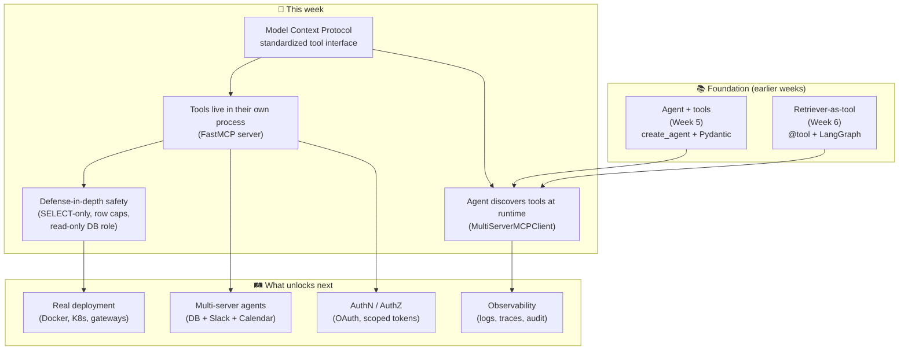
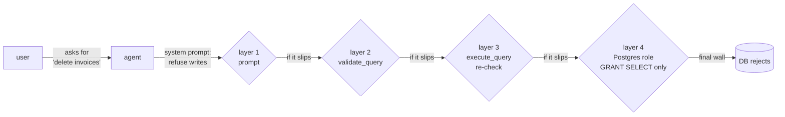
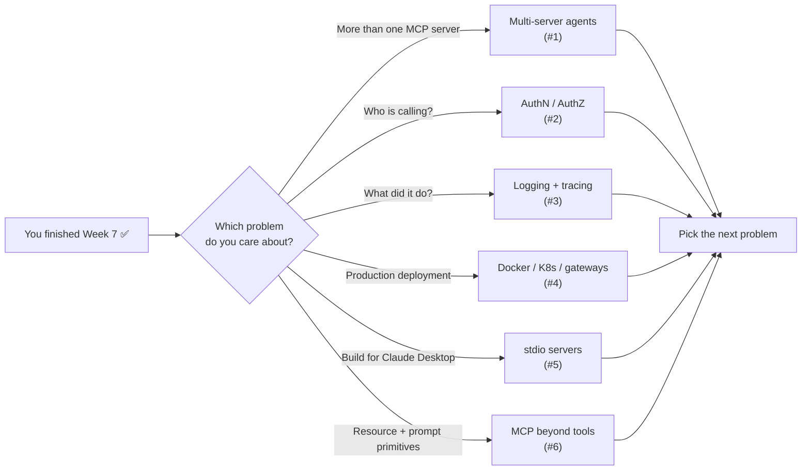

# Week 7 — What This Homework Teaches and Why It Matters

## How These Concepts Fit Together



## Why Are We Doing This?

In Weeks 5–6 every tool the agent could use was a Python function in the same process. That works for a single-developer demo. The moment you want the *same* tools used by a different agent — Claude Desktop, Cursor, your colleague's Go service, a cron job — you have a choice: copy the code, or put the tools behind a network protocol everyone speaks.

The **Model Context Protocol** (MCP) is that protocol. It is a small, JSON-RPC-based spec for "tool servers" that any LLM client can discover and call. This homework is the smallest meaningful project that exercises it: take a working SQL agent and split it into client + server.

Three big ideas underneath:

1. **Process isolation makes tools reusable.** The MCP server has no idea who is calling it — LangChain client today, Claude Desktop tomorrow. One server, many clients.
2. **Schema discovery beats hand-written glue.** The server publishes its tool definitions; the client reads them. You never write a "tool wrapper" by hand again.
3. **Trust boundaries become explicit.** When tools live in another process, you cannot pretend the caller is "trusted code." Every input must be validated. That is good practice — monolithic agents had the same risk; MCP just makes you face it.

## Key Concepts

### 1. The Model Context Protocol (MCP)

MCP is a JSON-RPC protocol that defines how an LLM client and a tool/resource server talk. Three primitives matter:

- **Tools** — functions the model can call (what we use in this homework).
- **Resources** — read-only documents the model can attach as context.
- **Prompts** — reusable prompt templates the server offers.

A working mental model: MCP is "USB for LLM tools" — one cable, many devices.

📚 Resources:
- [Anthropic — Introducing the Model Context Protocol](https://www.anthropic.com/news/model-context-protocol) — the launch post, best 5-minute intro
- [MCP specification](https://modelcontextprotocol.io/specification/2025-03-26) — the actual spec, surprisingly readable
- [MCP server quickstart](https://modelcontextprotocol.io/quickstart/server) — the official "build your first server" tutorial
- [Awesome MCP servers](https://github.com/modelcontextprotocol/servers) — reference implementations (filesystem, git, Postgres, Slack, …)

### 2. Transports: stdio vs streamable-http

MCP runs over a transport. The two that matter today:

- **`stdio`** — the server is a subprocess; client and server speak JSON-RPC over stdin/stdout. Used by Claude Desktop and Cursor for local-machine tools.
- **`streamable-http`** — JSON-RPC over HTTP plus Server-Sent Events for streaming. Works across the network, behind load balancers, with TLS.

Rule of thumb: `stdio` for "this tool runs on my laptop next to the editor", `streamable-http` for "this tool is a service".

📚 Resources:
- [MCP transports](https://modelcontextprotocol.io/specification/2025-03-26/basic/transports) — official reference
- [JSON-RPC 2.0 spec](https://www.jsonrpc.org/specification) — the wire format underneath
- [Server-Sent Events MDN guide](https://developer.mozilla.org/en-US/docs/Web/API/Server-sent_events/Using_server-sent_events)

### 3. FastMCP: Decorators for Tool Servers

`FastMCP` (in the official Python SDK) is the same idea as FastAPI — Python decorators that generate the JSON-RPC schema from your function signature and docstring. You write:

```python
@mcp.tool()
async def list_tables() -> str:
    """List every table the database exposes, comma-separated."""
    ...
```

…and the server publishes a tool with that name, that description, and an empty input schema. No hand-written JSON.

📚 Resources:
- [Python MCP SDK](https://github.com/modelcontextprotocol/python-sdk)
- [FastMCP examples](https://github.com/modelcontextprotocol/python-sdk/tree/main/examples)
- [Pydantic — schema generation](https://docs.pydantic.dev/latest/concepts/json_schema/) (FastMCP uses Pydantic under the hood)

### 4. langchain-mcp-adapters: Bridging Two Worlds

LangChain agents expect tools as `BaseTool` objects. MCP servers expose tools as JSON-RPC endpoints with JSON Schema. `langchain-mcp-adapters` is the glue:

```python
client = MultiServerMCPClient({"database": {"transport": "streamable_http", "url": "..."}})
tools = await client.get_tools()        # list[BaseTool]
agent = create_agent(model=model, tools=tools, ...)  # works, unchanged
```

The agent cannot tell whether a tool is local or remote. That is the point.

📚 Resources:
- [`langchain-mcp-adapters` repo](https://github.com/langchain-ai/langchain-mcp-adapters)
- [LangChain — `create_agent`](https://docs.langchain.com/oss/python/langchain/agents)

### 5. Why a SELECT-only Guard (and What Could Beat It)

The guard in `database_mcp_server.py` does three things:

1. Strips `--` and `/* ... */` comments so they cannot hide forbidden tokens.
2. Rejects `;` so a "piggyback" second statement is impossible.
3. Verifies the query starts with `SELECT` or `WITH` and contains no DDL/DML keywords.

This is a **good first layer**, not a complete defense. A real production system would also:

- Run the MCP server as a Postgres role with **`GRANT SELECT` only** — the database itself refuses writes regardless of what the application sends. See the [`pg_read_all_data` predefined role](https://www.postgresql.org/docs/current/predefined-roles.html).
- Set a **statement timeout** (`SET statement_timeout = '5s'`) so a `SELECT pg_sleep(60)` cannot tie up a worker.
- Use a **read replica** so even an accidental long query never touches the primary.
- Log every query to an append-only audit table.

📚 Resources:
- [OWASP — SQL Injection](https://owasp.org/www-community/attacks/SQL_Injection) — the classic reference
- [OWASP Top 10 for LLM Applications](https://owasp.org/www-project-top-10-for-large-language-model-applications/) — LLM-era equivalents
- [PostgreSQL — least privilege](https://www.postgresql.org/docs/current/predefined-roles.html)
- [Anthropic — prompt-injection guidance](https://docs.anthropic.com/en/docs/test-and-evaluate/strengthen-guardrails/mitigate-jailbreaks)

### 6. Schema Reflection with SQLAlchemy

`sqlalchemy.inspect(engine)` walks the live database and returns columns, primary keys, foreign keys, and indexes. The agent uses this to "see" the schema the same way a human DBA would: ask the database, do not hard-code.

```python
insp = inspect(engine)
insp.get_table_names()           # → ['Album', 'Artist', ...]
insp.get_columns('Album')        # → [{'name': 'AlbumId', 'type': INTEGER, ...}, ...]
insp.get_foreign_keys('Album')   # → [{'constrained_columns': ['ArtistId'], ...}]
```

📚 Resources:
- [SQLAlchemy 2.0 reflection](https://docs.sqlalchemy.org/en/20/core/reflection.html)
- [`Inspector` API](https://docs.sqlalchemy.org/en/20/core/reflection.html#sqlalchemy.engine.reflection.Inspector)

### 7. The Chinook Sample Database

Chinook models a digital music store: artists, albums, tracks, genres, customers, employees, invoices, invoice lines. It is the rare sample database that has **realistic JOINs, foreign keys, and dates** without being a 10 GB download. `lerocha/chinook-database` ships ready-made scripts for SQLite, Postgres, MySQL, and SQL Server.

📚 Resources:
- [Chinook database](https://github.com/lerocha/chinook-database)
- [Chinook ER diagram](https://github.com/lerocha/chinook-database/wiki/Chinook-Schema)

### 8. Defense in Depth

A single check is a single point of failure. Every layer in the call path can fail independently, so each one should refuse what it does not need:



Notice that the prompt, the application, and the database all enforce the same rule. That is not redundancy — that is each layer doing its own job.

📚 Resources:
- [NIST — Defense in Depth](https://csrc.nist.gov/glossary/term/defense_in_depth)
- [Google — SRE workbook on robustness](https://sre.google/workbook/postmortem-culture/)

## What You Should Be Able to Do After This

- Stand up an MCP server with FastMCP and explain why `streamable-http` differs from `stdio`.
- Use `langchain-mcp-adapters` to consume a remote MCP server as if its tools were local.
- Reason about a tool's trust boundary: which inputs are user-controlled, where they get validated, and what the worst case is.
- Layer safety: prompt → application allow-list → database role.
- Reflect a SQL schema with SQLAlchemy and serve it back to an LLM as natural-language-friendly text.

---

## 🛤️ Where to Go Next



### 1. Multiple MCP servers in one agent

`MultiServerMCPClient` accepts a dict of servers. The natural next project is to combine the database server with a second one — a Slack server, a calendar server, or the official filesystem reference server — and let the agent route between them.

📚 Resources:
- [Reference MCP servers](https://github.com/modelcontextprotocol/servers) — Slack, GitHub, Filesystem, Postgres, …
- [`langchain-mcp-adapters` — multi-server example](https://github.com/langchain-ai/langchain-mcp-adapters#multi-server-example)

### 2. Authentication and Authorization

The server in this homework trusts everyone on `localhost`. In production you need to know **who** is calling and **what they are allowed to do**. MCP does not mandate a specific auth scheme; the common patterns are bearer tokens (validate on every request) and OAuth (rotate per user).

📚 Resources:
- [OAuth 2.1 draft](https://datatracker.ietf.org/doc/html/draft-ietf-oauth-v2-1) — the modern OAuth profile
- [`fastapi.security`](https://fastapi.tiangolo.com/tutorial/security/) — same patterns work for FastMCP
- [MCP — auth discussion](https://modelcontextprotocol.io/docs/concepts/architecture#authentication)

### 3. Observability: Logging, Tracing, Audit

When something breaks at 3 AM you need to answer two questions: "what query did the agent run?" and "what did it return?" The minimum set:

- Structured logs (one JSON line per tool call).
- An OpenTelemetry trace per agent turn.
- An append-only audit table for every executed query.

📚 Resources:
- [OpenTelemetry — Python](https://opentelemetry.io/docs/languages/python/)
- [LangSmith](https://docs.smith.langchain.com/) — built-in tracing for LangChain agents
- [Phoenix by Arize](https://docs.arize.com/phoenix) — OSS alternative

### 4. Real Deployment

Local `python database_mcp_server.py` is fine for development. Production wants:

- A container image that runs the server as a non-root user.
- A reverse proxy (Caddy, nginx, Traefik) for TLS.
- A health probe so Kubernetes can restart a wedged worker.
- Horizontal scaling — MCP servers are stateless if they do not share memory.

📚 Resources:
- [Docker — multi-stage Python images](https://docs.docker.com/build/building/multi-stage/)
- [Caddy reverse proxy](https://caddyserver.com/docs/quick-starts/reverse-proxy) — TLS with one line of config
- [Kubernetes liveness/readiness probes](https://kubernetes.io/docs/tasks/configure-pod-container/configure-liveness-readiness-startup-probes/)

### 5. stdio Servers for Claude Desktop / Cursor

The `streamable-http` server in this homework speaks the network. The other half of the MCP world speaks `stdio` — Claude Desktop, Cursor, and Zed launch a subprocess and pipe JSON-RPC over its stdio. Same `FastMCP` code, different `mcp.run(transport="stdio")` line.

📚 Resources:
- [Claude Desktop — MCP setup](https://modelcontextprotocol.io/quickstart/user)
- [Cursor — MCP integration](https://docs.cursor.com/context/model-context-protocol)
- [Zed — MCP support](https://zed.dev/docs/assistant/model-context-protocol)

### 6. Resources and Prompts (Beyond Tools)

We only used the **tools** primitive. MCP also defines:

- **Resources** — read-only documents the server publishes (e.g., "the latest invoice as a PDF"). The client attaches them as context.
- **Prompts** — reusable parameterized prompt templates the server offers (e.g., `summarize_invoice(invoice_id)`).

These let you build *thicker* MCP servers that ship not just functions but ready-made workflows.

📚 Resources:
- [MCP — Resources](https://modelcontextprotocol.io/specification/2025-03-26/server/resources)
- [MCP — Prompts](https://modelcontextprotocol.io/specification/2025-03-26/server/prompts)

---

## A Suggested Learning Path

Pick **one** of the six branches above and ship a tiny project. Reading first is fine; you only own the idea after you debug a real failure.

The fastest path for most people: do (1) multi-server agents next. Adding a second MCP server (filesystem or Slack) takes ~30 minutes and forces you to think about routing, schema collisions, and prompt design — three skills that pay off in every direction afterward.
